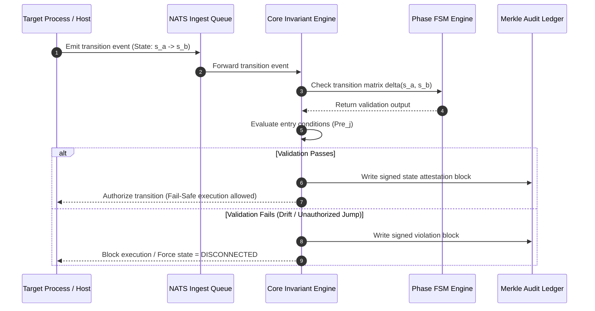
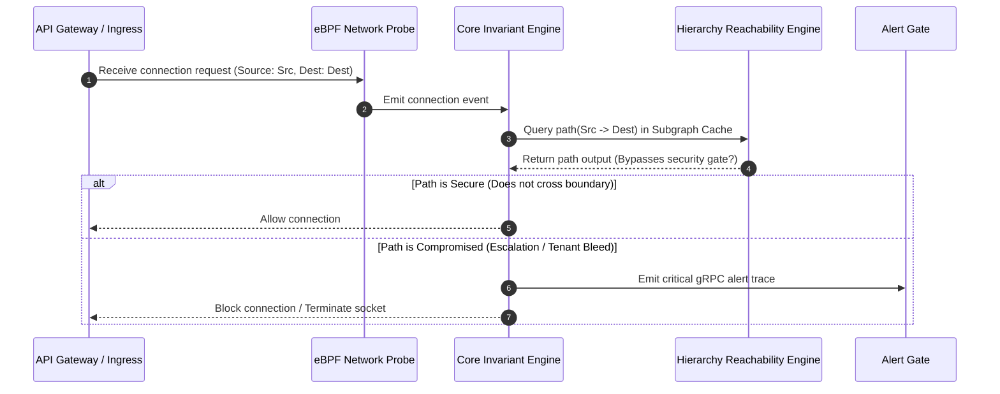
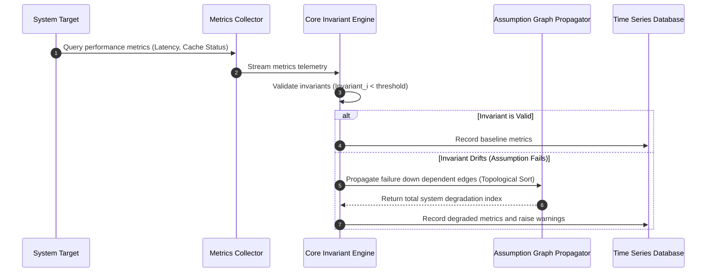
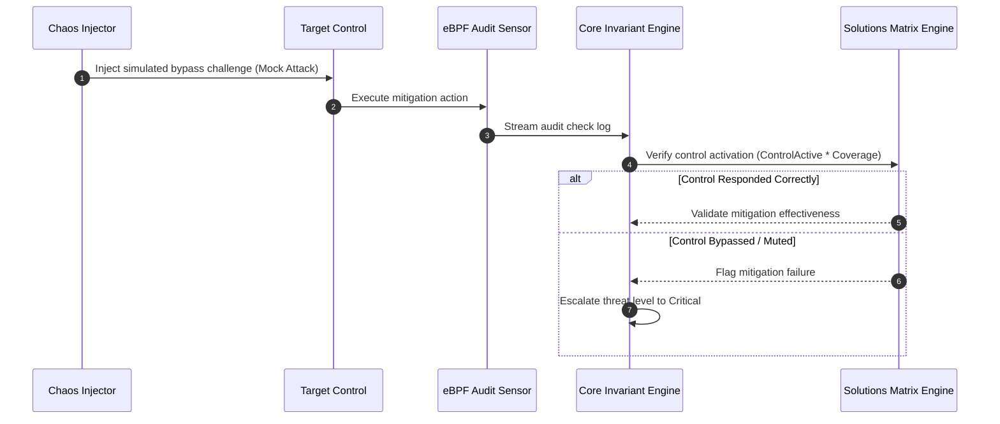
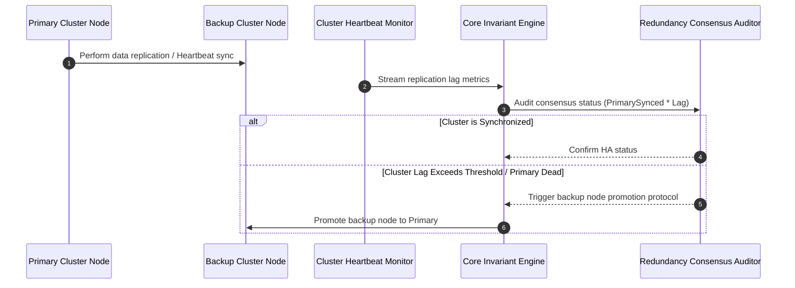

# PHASR | Workflows Data Path & Flow Specification

This document details the complete data pathways, system execution flows, and integration mappings for the five codebase security verification workflows within the **PHASR** validation platform.

---

## 1. Global System Data Flow Map

The diagram below maps every telemetry pipeline, validation engine loop, ledger storage stream, and alert execution path in the global PHASR engine.

```mermaid
graph TB
    subgraph Data Plane [1. Telemetry Capture & Normalization]
        eBPF_Sys[eBPF Sensors: Syscalls] -->|C-struct payload| Normalizer[Normalization Plane]
        eBPF_Net[eBPF Sensors: Network] -->|C-struct payload| Normalizer
        Configs[configs: IaC / RBAC] -->|JSON Parser| Normalizer
        DB_Logs[Database Logs] -->|Polled stream| Normalizer
    end

    subgraph Pipeline Plane [2. Ingestion & Priority Queues]
        Normalizer -->|Protobuf Events| NATS{NATS JetStream Ingest Bus}
        NATS -->|Priority 0: Real-Time| P0_Queue[Active Invariant Evaluation Queue]
        NATS -->|Priority 1: Delayed| P1_Queue[Historical Analytics Queue]
    end

    subgraph Core Engine Plane [3. Invariant Evaluation & Graph Mapping]
        P0_Queue --> CoreEngine[Core Invariant Evaluator]
        ActiveSpec[(Active Spec Graph)] <-->|DFS / BFS Reachability| SubgraphCache[(In-Memory Subgraph Cache)]
        SubgraphCache <--> CoreEngine
        
        subgraph SubEngines [P-H-A-S-R Validators]
            P_Eng[Phase FSM Validator]
            H_Eng[Hierarchy Reachability Validator]
            A_Eng[Assumption Graph Propagator]
            S_Eng[Solutions Mitigation Verifier]
            R_Eng[Redundancy Consensus Auditor]
        end
        
        CoreEngine <--> SubEngines
    end

    subgraph Storage & Exporter Plane [4. Attestation & Alert Outgress]
        CoreEngine -->|State Attestation| MerkleProcessor[Merkle Tree Hash Processor]
        MerkleProcessor -->|Ledger Block| AuditDb[(Append-Only Ledger Database)]
        CoreEngine -->|Violation Proof Traces| AlertEngine[Proof Trace Generator]
        AlertEngine -->|gRPC / TLS| SecOpsAlerts[SecOps Alert Gateway]
    end

    style Core Engine Plane fill:#05050a,stroke:#ff003c,stroke-width:2px
    style Pipeline Plane fill:#0a0a0f,stroke:#00f3ff,stroke-width:1px
    style Storage & Exporter Plane fill:#0d0d12,stroke:#00ffaa,stroke-width:1px
```

---

## 2. Telemetry Connecting Points Matrix

The following matrix maps every data path from telemetry source to its target workflow and verification type:

| Telemetry Source | Data Path Interface | Target Workflow | Verification Type |
| :--- | :--- | :--- | :--- |
| **eBPF: Syscalls & Execs** | Kernel Ring Buffer -> Protobuf -> NATS P0 | **Workflow 1: Phase** | Temporal execution sequencing check. |
| **eBPF: Network Connects** | Kernel Ring Buffer -> Protobuf -> NATS P0 | **Workflow 2: Hierarchy** | Access boundary & reachability audit. |
| **IAM & RBAC Configs** | Static Config Parsers -> Active Spec Graph | **Workflow 2: Hierarchy** | Privilege boundary & role audit. |
| **App Logs & Metrics** | Systemd / File Monitors -> Normalizer -> NATS P1 | **Workflow 3: Assumptions** | Invariant drift & performance decay check. |
| **Audit Trail Logs** | File Poller -> Protobuf Normalizer -> NATS P0 | **Workflow 4: Solutions** | Control active status validation. |
| **Chaos Injector** | Sandbox CLI Interface -> Mock Attacks API | **Workflow 4: Solutions** | Bypass-resistance & control challenge check. |
| **Database Replication Logs** | Database Engine Poller -> TSDB Stream | **Workflow 5: Redundancy** | Sync lag & consensus heartbeat validation. |

---

## 3. Detailed Data Flows of the 5 Workflows

### 3.1 Workflow 1: Phase Lifecycle Verification
Validates execution sequencing. Prevents unauthorized state-jumps.



### 3.2 Workflow 2: Privilege Path reachability Verification
Audits access paths and privilege boundaries on the active reachability graph.



### 3.3 Workflow 3: Invariant Drift & Assumption Decay Verification
Monitors implicit dependencies and performance invariants to detect architectural drift.



### 3.4 Workflow 4: Solution Control Verification
Attests to mitigation readiness, ensuring every threat has an active, bypass-resistant control.



### 3.5 Workflow 5: Redundancy Failover Attestation
Validates replication states, consensus group health, and session preservation.


