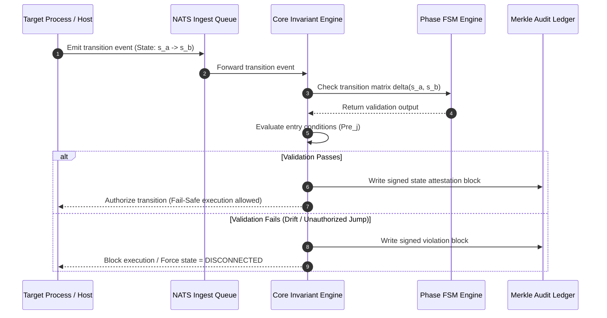
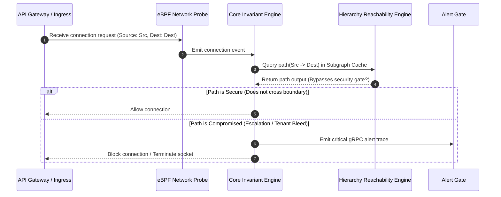
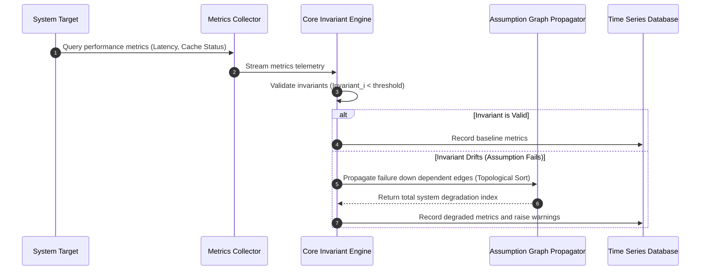
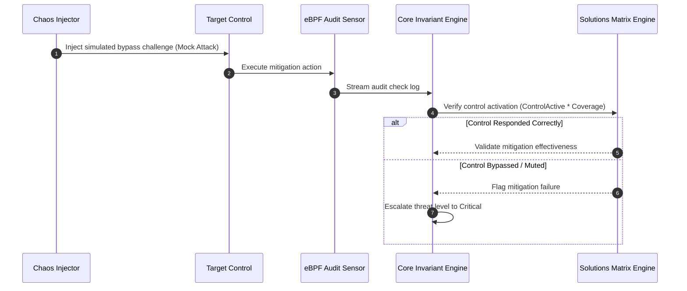
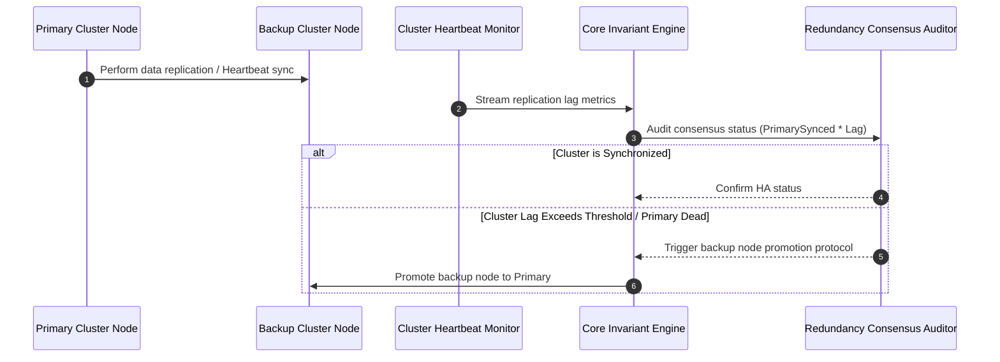
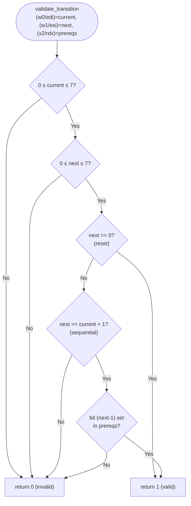
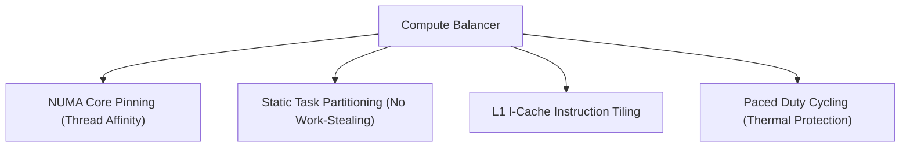

# PHASR | Workflows Data Path & Flow Specification

This document details the complete data pathways, system execution flows, integration mappings, and **platform-specific assembly back-end architecture** for the five codebase security verification workflows within the **PHASR** validation platform.

---

## 1. Global System Data Flow Map

The diagram below maps every telemetry pipeline, validation engine loop, ledger storage stream, and alert execution path in the global PHASR engine.

```mermaid
graph TB
    subgraph Data Plane [1. Telemetry Capture & Normalization]
        eBPF_Sys[eBPF Sensors: Syscalls] -->|C-struct payload| Normalizer[Normalization Plane]
        eBPF_Net[eBPF Sensors: Network] -->|C-struct payload| Normalizer
        Configs[configs: IaC / RBAC] -->|JSON Parser| Normalizer
        DB_Logs[Database Logs] -->|Polled stream| Normalizer
    end

    subgraph Pipeline Plane [2. Ingestion & Priority Queues]
        Normalizer -->|Protobuf Events| NATS{NATS JetStream Ingest Bus}
        NATS -->|Priority 0: Real-Time| P0_Queue[Active Invariant Evaluation Queue]
        NATS -->|Priority 1: Delayed| P1_Queue[Historical Analytics Queue]
    end

    subgraph Core Engine Plane [3. Invariant Evaluation & Graph Mapping]
        P0_Queue --> CoreEngine[Core Invariant Evaluator]
        ActiveSpec[(Active Spec Graph)] <-->|DFS / BFS Reachability| SubgraphCache[(In-Memory Subgraph Cache)]
        SubgraphCache <--> CoreEngine
        
        subgraph SubEngines [P-H-A-S-R Validators]
            P_Eng["Phase FSM Validator\n(x86-64 MASM / ARM64 GAS / C-fallback)"]
            H_Eng[Hierarchy Reachability Validator]
            A_Eng[Assumption Graph Propagator]
            S_Eng[Solutions Mitigation Verifier]
            R_Eng[Redundancy Consensus Auditor]
        end
        
        CoreEngine <--> SubEngines
    end

    subgraph Storage & Exporter Plane [4. Attestation & Alert Outgress]
        CoreEngine -->|State Attestation| MerkleProcessor[Merkle Tree Hash Processor]
        MerkleProcessor -->|Ledger Block| AuditDb[(Append-Only Ledger Database)]
        CoreEngine -->|Violation Proof Traces| AlertEngine[Proof Trace Generator]
        AlertEngine -->|gRPC / TLS| SecOpsAlerts[SecOps Alert Gateway]
    end

    style Core Engine Plane fill:#05050a,stroke:#ff003c,stroke-width:2px
    style Pipeline Plane fill:#0a0a0f,stroke:#00f3ff,stroke-width:1px
    style Storage & Exporter Plane fill:#0d0d12,stroke:#00ffaa,stroke-width:1px
```

---

## 2. Telemetry Connecting Points Matrix

The following matrix maps every data path from telemetry source to its target workflow and verification type:

| Telemetry Source | Data Path Interface | Target Workflow | Verification Type |
| :--- | :--- | :--- | :--- |
| **eBPF: Syscalls & Execs** | Kernel Ring Buffer -> Protobuf -> NATS P0 | **Workflow 1: Phase** | Temporal execution sequencing check. FSM evaluated by `validate_transition` (x86-64/ARM64). |
| **eBPF: Network Connects** | Kernel Ring Buffer -> Protobuf -> NATS P0 | **Workflow 2: Hierarchy** | Access boundary & reachability audit. |
| **IAM & RBAC Configs** | Static Config Parsers -> Active Spec Graph | **Workflow 2: Hierarchy** | Privilege boundary & role audit. |
| **App Logs & Metrics** | Systemd / File Monitors -> Normalizer -> NATS P1 | **Workflow 3: Assumptions** | Invariant drift & performance decay check. |
| **Audit Trail Logs** | File Poller -> Protobuf Normalizer -> NATS P0 | **Workflow 4: Solutions** | Control active status validation. |
| **Chaos Injector** | Sandbox CLI Interface -> Mock Attacks API | **Workflow 4: Solutions** | Bypass-resistance & control challenge check. |
| **Database Replication Logs** | Database Engine Poller -> TSDB Stream | **Workflow 5: Redundancy** | Sync lag & consensus heartbeat validation. |

---

## 3. Detailed Data Flows of the 5 Workflows

### 3.1 Workflow 1: Phase Lifecycle Verification
Validates execution sequencing. Prevents unauthorized state-jumps.



### 3.2 Workflow 2: Privilege Path reachability Verification
Audits access paths and privilege boundaries on the active reachability graph.



### 3.3 Workflow 3: Invariant Drift & Assumption Decay Verification
Monitors implicit dependencies and performance invariants to detect architectural drift.



### 3.4 Workflow 4: Solution Control Verification
Attests to mitigation readiness, ensuring every threat has an active, bypass-resistant control.



### 3.5 Workflow 5: Redundancy Failover Attestation
Validates replication states, consensus group health, and session preservation.



---

## 4. Phase FSM Validator — Multi-Platform Assembly Architecture

The Phase FSM Engine (`validate_transition`) is the innermost hot-path of Workflow 1. To maximize throughput and portability across deployment targets it ships as **four interchangeable back-ends**, selected at compile time:

| Back-end | File | Target | Assembler / Compiler | Lines |
| :--- | :--- | :--- | :--- | :--- |
| **x86-64 MASM** | `fsm_validator.asm` | Windows x86-64 | MSVC `ml64.exe` | ~117 K |
| **x86-64 GAS (Intel)** | `fsm_validator_linux_x64.s` | Linux x86-64 | GNU `as` / `gcc` | 130,562 |
| **AArch64 GAS** | `fsm_validator_linux_arm64.s` | Linux ARM64 | GNU `as` / `gcc` | 130,559 |
| **Pure-C Fallback** | `fsm_validator_fallback.c` | Any platform | Any C99 compiler | ~65 |

### 4.1 Shared Logic — 4,500 Helper Procedures

Both assembly back-ends emit an identical set of **4,500 helper procedures** (`validate_path_0000` … `validate_path_4499`) plus one **master dispatcher** (`validate_transition`). The helper index `i` encodes:

```
current_state  = i % 8
next_state     = (i + 1) % 8
prereq_bit     = next_state > 0 ? next_state - 1 : 0
```

Each helper performs three checks in sequence:
1. **State match** — compare `current_state` and `next_state` against register arguments, branch to *no-match* (`-1`) if wrong.
2. **Prerequisite bit** — test bit `prereq_bit` in the `prerequisites` argument, branch to *invalid* (`0`) if clear.
3. **Valid return** — return `1` if both checks pass.

### 4.2 Linux x86-64 GAS Back-end (Intel Syntax) — Key Facts

```
Calling convention : System V AMD64 ABI
  edi = current_state (int32)      // first parameter
  esi = next_state    (int32)      // second parameter
  rdx = prerequisites (uint64_t)   // third parameter (64-bit)
  eax = return value  (1 / 0 / -1)

Key instructions used:
  .intel_syntax noprefix           // Use Intel style assembly syntax
  cmp  edi, N                      // 32-bit comparison of current state
  cmp  esi, N                      // 32-bit comparison of next state
  shl  rax, cl                     // Shift rax by cl bits (cl is the lower 8 bits of rcx)
  test rdx, rax                    // Test if prerequisite bit is set
  xor  eax, eax                    // Return 0
  mov  eax, -1                     // Return -1
  ret                              // Return to caller
```

### 4.3 ARM64 AArch64 GAS Back-end — Key Facts

```
Calling convention : AAPCS64
  w0  = current_state (int32)      // w-register = 32-bit view of x0
  w1  = next_state    (int32)
  x2  = prerequisites (uint64_t)   // full 64-bit
  w0  = return value  (1 / 0 / -1)

Key instructions used:
  cmp  w0, #N          // 32-bit comparison
  b.ne / b.eq / b.lt / b.gt / b.ge
  cbz  w1, label       // compare-and-branch-if-zero (no flags needed)
  mov  x3, #1
  lsl  x3, x3, x4     // x3 = 1 << x4   (64-bit left shift)
  tst  x2, x3         // bitwise AND, sets NZCV flags
  mvn  w0, wzr         // w0 = 0xFFFFFFFF = -1 (signed)
  ret                  // return via link register x30
```

### 4.4 Master `validate_transition` — Control Flow



### 4.5 Build Matrix

| Platform | Command | Back-end selected |
| :--- | :--- | :--- |
| **Windows x86-64** | `cd phasr\Phase-1 && build.bat` | `fsm_validator.asm` (MASM ml64) |
| **Linux x86-64** | `cd phasr/Phase-1 && make` | `fsm_validator_linux_x64.s` (GAS Intel) |
| **Linux AArch64** | `cd phasr/Phase-1 && make` | `fsm_validator_linux_arm64.s` (GAS) |
| **Any other** | `cd phasr/Phase-1 && make fallback` | `fsm_validator_fallback.c` (C99) |
| **Regenerate x64 .s** | `node generate_fsm_asm_linux_x64.js` | *(re-generates 130,562 lines)* |
| **Regenerate ARM64 .s** | `node generate_fsm_asm_arm64.js` | *(re-generates 130,559 lines)* |

---

## 5. Phase-2 Hierarchy Reachability Engine

The **Hierarchy Reachability Engine** audits access paths and privilege boundaries on the active reachability graph.

### 5.1 Adjacency and Reachability Matrices
The access graph is flattened in memory as a contiguous bit-packed matrix of size $16 \times 16$:
- Adjacency matrix: `uint16_t adjacency[16]` where bit $j$ in row $i$ is set if there is an edge $i \rightarrow j$.
- Reachability matrix: `uint16_t reachability[16]` representing the transitive closure (with self-reachability) of the adjacency matrix.

### 5.2 ARM64 NEON assembly implementation
The core transitive closure sweep is implemented in raw ARM64 assembly ([reachability_arm64.s](file:///d:/Project%20XT/phasr/Phase-2/reachability_arm64.s)) utilizing ARM64 registers for bit-packed rows, executing Warshall's algorithm with zero runtime heap allocation.

### 5.3 Build Matrix
- **Windows:** Run `cd phasr\Phase-2 && build.bat` to build and run using the MSVC C++ fallback engine.
- **Linux ARM64:** Run `cd phasr/Phase-2 && make` to build and run using the ARM64 NEON Assembly engine.
- **Linux non-ARM64:** Run `cd phasr/Phase-2 && make` to build and run using the C++ fallback engine.

---

## 6. Custom Compute Balancer & Hardware Thermal Protection

To ensure deterministic, repeatable, and safe execution across thousands of unrolled invariant validator loops, PHASR implements a custom-designed **Deterministic Compute Balancer** across all workflows.

### 6.1 Balancer Design Principles



- **Deterministic Thread Affinity:** Forces worker threads to lock onto specific physical CPU cores (e.g., `SetThreadAffinityMask` on Windows, `pthread_setaffinity_np` on Linux).
- **Static Round-Robin Partitioning:** Tasks (test batches) are mapped to threads via $T = C \pmod N$. This bypasses runtime dynamic work-stealing, eliminating scheduler non-determinism.
- **Paced Duty Cycling:** Worker threads yield using millisecond sleep cycles at fixed batch boundaries to cool the CPU junction temperature and avoid thermal throttling.
- **Thread-Safety & Race Prevention:** Shared statistics and data structures (such as Phase 3 eBPF ring buffers) are configured as thread-local parameters to prevent write-collisions and guarantee 100% deterministic assertion audits.


