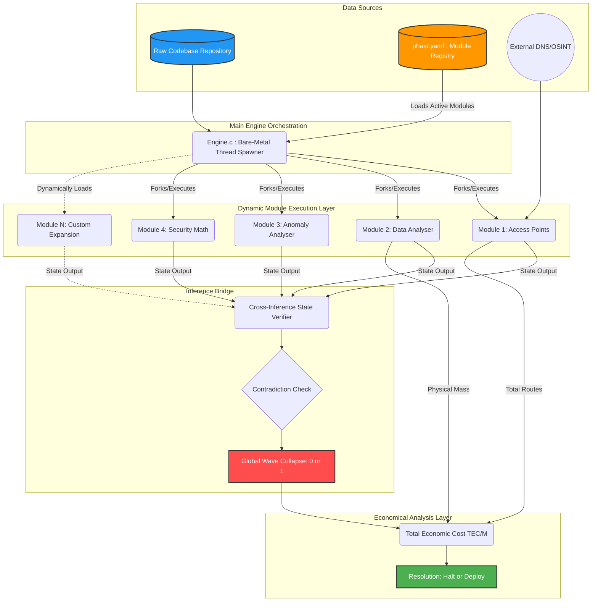

# PHASR (DEVM) - Global Data Flow & Relationship Architecture

This document maps the exact flow of data through the PHASR DEVM. It has been updated to reflect the **Dynamic Module Registry** pattern, ensuring the Main Engine complies with the Open/Closed Principle (Open for extension, Closed for modification). 

## Global State Resolution Map

## Data Relationship Breakdown

### 1. The Dynamic Ingestion (The Registry)
The C Orchestrator (`Engine.c`) no longer hardcodes modules. It ingests a manifest (`phasr.yaml`) at runtime. This registry dictates exactly which modules exist and should be executed, allowing infinite horizontal scaling of security constraints without ever needing to recompile the Core Engine.

### 2. The Isolated Scanners (M1 ... Mn)
Each module acts as a completely isolated observer of the codebase, spun up in parallel by the Main Engine.
*   **M1** maps the boundaries.
*   **M2** weighs the physical mass.
*   **M3** measures the randomness (entropy).
*   **M4** traces the data flows (Input to Execution).
*   **Mn** (Any future module dynamically loaded via the registry).

### 3. The Inference Bridge
This is the physical C++ layer that forces the isolated states to interact. It receives the outputs of `N` modules and checks for contradictions (e.g., "If M1 found no shadow endpoints, why is M2's AST depth 50 levels deep?"). If there is a contradiction, or if *any* single module in the dynamic registry returned a `0`, the Bridge executes a **Wave Collapse**, reducing the global state to `0`.

### 4. The Business Resolution
The `0` or `1` state, along with the raw physical metrics (Total Bytes, Total Endpoints), is routed to the OCaml Business Logic layer. This translates the physics into **Liability and Maintenance Costs (TEC/M)**, yielding the final executive decision: **Halt or Deploy**.
