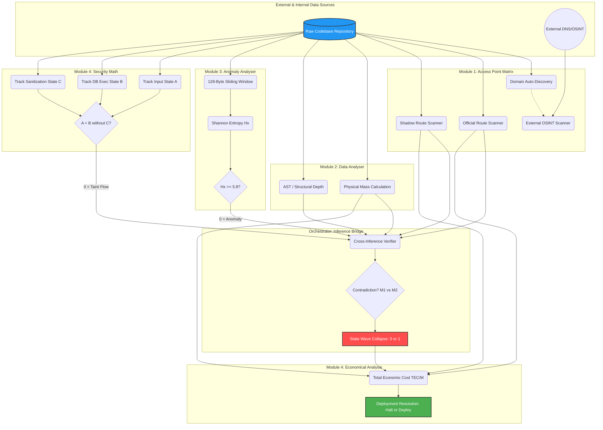

# PHASR (DEVM) - Global Data Flow & Relationship Architecture

This document maps the exact flow of data through the 4 Pillars of the DEVM and how the isolated states mathematically interact to form the final Total Economic Cost (TEC/M) and Deployment Status.

## Global State Resolution Map

## Data Relationship Breakdown

### 1. The Inputs
The system ingests two absolute realities: the **Raw Source Code** and the **External Internet** footprint.

### 2. The Isolated Scanners (M1, M2, M3, M4)
Each module acts as a completely isolated observer of the codebase. 
*   **M1** maps the boundaries.
*   **M2** weighs the physical mass.
*   **M3** measures the randomness (entropy).
*   **M4** traces the data flows (Input to Execution).

### 3. The Orchestration Bridge
This is the physical C++ layer that forces the isolated states to interact. It receives the array of endpoints (M1) and the structural depth (M2) and checks for contradictions (e.g., "If M1 found no shadow endpoints, why is M2's AST depth 50 levels deep?"). If there is a contradiction, or if any module returned a `0`, the Bridge executes a **Wave Collapse**, reducing the entire state of the codebase to `0`.

### 4. The Business Resolution
The `0` or `1` state, along with the raw physical metrics (Total Bytes, Total Endpoints), is routed to the OCaml Business Logic layer. This translates the physics into **Liability and Maintenance Costs (TEC/M)**, yielding the final executive decision: **Halt or Deploy**.
