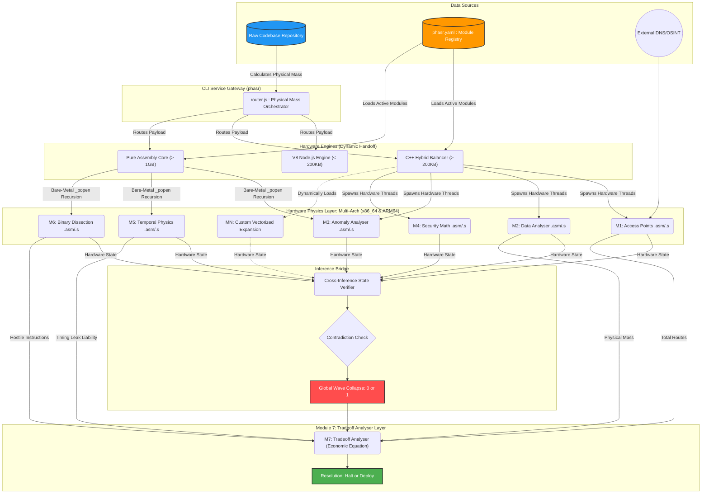

# PHASR (DEVM) - Global Data Flow & Relationship Architecture

This document maps the exact flow of data through the PHASR DEVM. It has been updated to reflect the **Dynamic Module Registry** pattern and the **x86_64 Unrolled Assembly** hardware physics layer, including Module 5 (Temporal Physics).

## Global State Resolution Map

## Data Relationship Breakdown

### 1. The CLI Service Gateway & Ingestion
The unified `phasr` CLI (`router.js`) acts as the entry point and Service Gateway. It calculates the physical mass of the codebase and dynamically routes execution to the Node.js Engine, C++ Hybrid Balancer, or the Pure Assembly Hardware Override. These engines ingest a manifest (`phasr.yaml`) at runtime, dictating exactly which assembly modules should be executed.

### 2. The Hardware Physics Layer (M1 ... Mn)
Each module acts as a completely isolated observer of the codebase, executed as a raw binary. They are natively written in **Dual-Architecture Unrolled Assembly (x86_64 NASM and ARM64 AArch64)**. This allows the Engine to route evaluation vectors to the correct native silicon instructions (e.g., bypassing branch predictors using `CMOVG` on Intel or `CSEL` on Apple Silicon), running at literal hardware clock speed without translation crutches like Rosetta.
*   **M1** maps boundaries via unrolled SIMD string matching.
*   **M2** weighs mass via unrolled loop byte evaluation (x86 & ARM64).
*   **M3** calculates entropy using the hardware FPU `FYL2X` instruction.
*   **M4** traces data flows via bare-metal state mapping.
*   **M5** measures temporal side-channel leaks using the `RDTSC` instruction.
*   **M6** dynamically disassembles compiled artifacts to statically evaluate register manipulation.
*   **Mn** (Any future `.asm` module dynamically loaded via the registry).

### 3. The Inference Bridge
This is the layer that forces the isolated states to interact. It receives the outputs of `N` hardware modules and checks for contradictions. If there is a contradiction, or if *any* single module in the dynamic registry returned a `0`, the Bridge executes a **Wave Collapse**, reducing the global state to `0`.

### 4. The Business Resolution (Module 7)
The `0` or `1` state, along with the raw physical metrics, is routed to **Module 7 (Tradeoff Analyser)**. This translates the physics into **Absolute Financial Liability vs Maintenance Costs**, yielding the final cryptoeconomic decision: **Halt or Deploy**.
