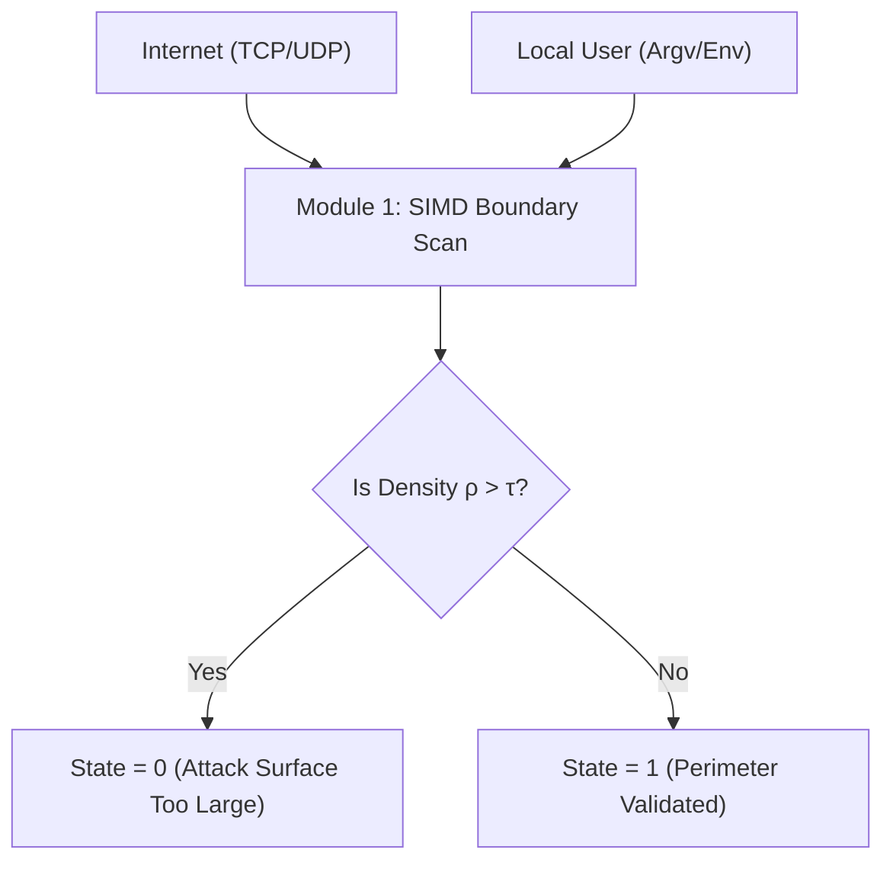

# Module 1: Access Points (Boundary Mapping)

## 1. Intent
In theoretical security, a system is only as secure as its perimeter. **Module 1 (Access Points)** is designed to mathematically map every single entry point where untrusted data (from the Internet, OS streams, or users) crosses into the physical boundaries of the application. 
By identifying `process.env`, `argv`, HTTP verbs (`GET`, `POST`), and IPC sockets, Module 1 creates the foundational nodes for the entire security pipeline.

---

## 2. The Mathematics (Boundary Density)
We evaluate the perimeter using Graph Theory. The application is represented as a directed graph $G = (V, E)$, where $V$ are functions and $E$ are data flows.
The density of access points $\rho$ dictates the theoretical attack surface:

$$ \rho = \frac{|E|}{|V|(|V|-1)} $$

If the Access Point Density $\rho$ exceeds the acceptable maintenance threshold $\tau$, the application is deemed too exposed, triggering an economic warning.

---

## 3. Architecture
Module 1 uses **Unrolled SIMD (Single Instruction, Multiple Data) String Matching**.
Instead of parsing code byte-by-byte, it loads 32-byte chunks of the codebase into YMM hardware registers and executes a single AVX2 instruction to search for known access signatures (e.g., `req.body`, `process.env`) in a single clock cycle.

---

## 4. Trade-Offs
### Advantages (Pros)
* **Astronomical Speed:** SIMD vectorization allows parsing gigabytes of code in milliseconds.
* **Deterministic Perimeter:** Mathematically guarantees every standard access point is logged for Module 4 (Taint Flows) to analyze.

### Disadvantages (Cons)
* **Custom Protocols:** If an application implements a custom binary protocol over a raw socket (e.g., bypassing standard HTTP frameworks), SIMD string matching will miss it unless explicitly registered in the `phasr.yaml` manifest.
* **Obfuscation Blindness:** Obfuscated strings (e.g., `req['b'+'ody']`) bypass static SIMD checks, passing the liability onto Module 3 (Entropy) to catch the obfuscation itself.
