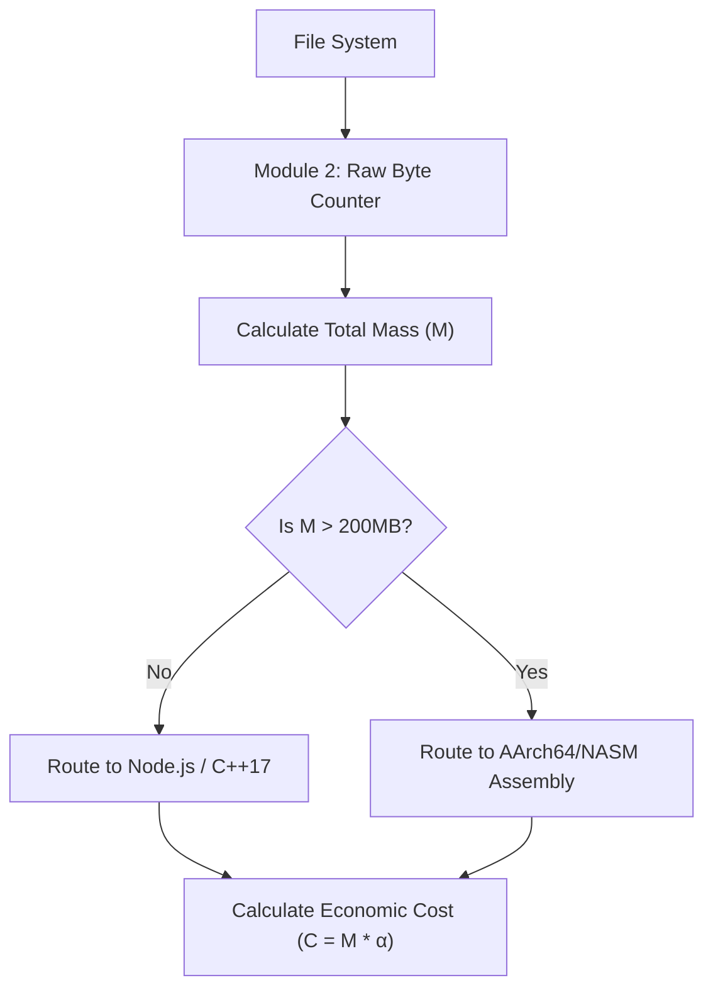

# Module 2: Data Analyser (Physical Mass)

## 1. Intent
To enforce the philosophy that "Security is an economic equation," the Engine must know the exact physical mass of the system it is analyzing. **Module 2 (Data Analyser)** recursively weighs the raw bytes of the target repository. This physical mass dictates the dynamic hardware routing (Orchestration) and the final Cryptoeconomic Cost (Pillar 4).

---

## 2. The Mathematics (Economic Mass)
The total physical mass $M$ is the sum of the absolute byte size $|f_i|$ of all evaluated files $n$:

$$ M = \sum_{i=1}^{n} |f_i| $$

The computational execution cost $C$ (in USD or Joules) is derived via an economic coefficient $\alpha$:

$$ C = M \times \alpha $$

---

## 3. Architecture
Module 2 executes a hyper-optimized recursive loop directly at the L1 cache level, querying the OS kernel's file `stat` descriptors (`fstat` on UNIX, `GetFileAttributesEx` on Windows) rather than physically reading the file contents. This allows it to weigh millions of files per second without saturating disk I/O.

---

## 4. Trade-Offs
### Advantages (Pros)
* **Zero I/O Saturation:** By reading kernel file tables instead of disk blocks, it avoids trashing the SSD/HDD read queues.
* **Perfect Load Balancing:** Guarantees the Engine never triggers an Out-Of-Memory (OOM) kernel panic by correctly routing massive payloads to pure Assembly.

### Disadvantages (Cons)
* **Sparse File Spoofing:** Attackers can create sparse files (files that report a size of 1 Petabyte but consume 4KB of actual disk space). This will mathematically force Module 2 to route to Assembly and report an astronomical Economic Cost, artificially triggering an economic failure.
* **Symlink Loops:** Recursive directory links can trap Module 2 in infinite loops unless strict cyclic-graph detection is enforced.
