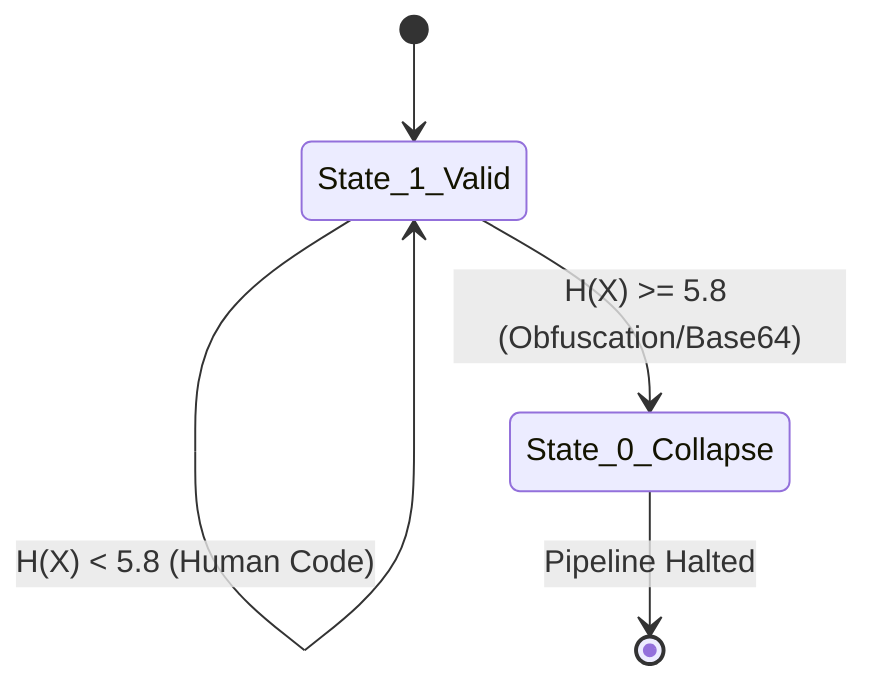
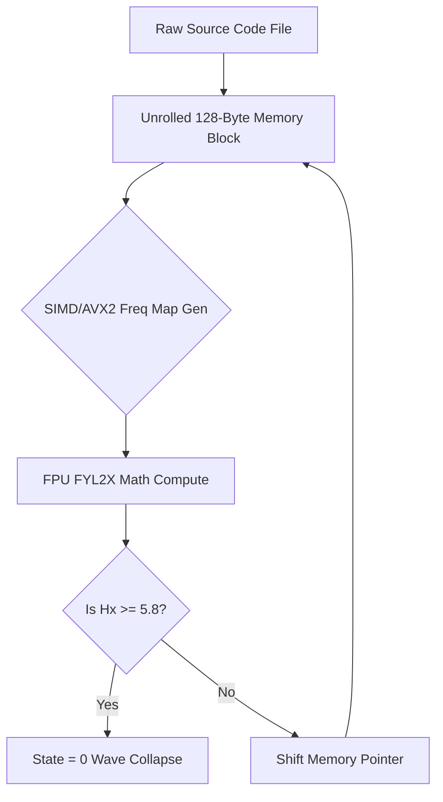

# Module 3: Shannon Entropy Architecture

## 1. Intent
The standard industry approach to malware detection relies on **heuristics and signatures**—searching for known strings like `eval()`, `exec()`, or known bad hex bytes. The fundamental flaw in this approach is that it is a *reactive* guessing game. If a threat actor obfuscates their payload or writes a 0-day exploit that doesn't match an existing signature, the system fails.

**The Intent of Module 3** is to replace heuristic guessing with **Deterministic Mathematical Physics**. By applying **Shannon Entropy**, the DEVM stops caring *what* the code says, and instead measures *how unpredictable* the code is. Human-written logic has mathematical structure and predictability. Malware, obfuscators, and packed payloads intentionally destroy predictability to evade scanners. Module 3 measures this randomness as an absolute physical property.

---

## 2. The Mathematics
Shannon Entropy $H(X)$ calculates the absolute randomness (unpredictability) of a dataset.

$$H(X) = - \sum_{i=1}^{n} P(x_i) \log_2 P(x_i)$$

*   **Normal Code Entropy**: ~4.0 to 5.2 (High predictability due to keywords, standard syntax, and spacing).
*   **Base64/Packed Entropy**: ~5.8 to 6.0.
*   **Raw Encrypted Shellcode**: ~8.0 (Maximum entropy).

By establishing a hard physical threshold (e.g., $H(X) \ge 5.8$), we create a physical boundary that obfuscated payloads cannot cross without triggering a mathematical wave collapse (State = 0).

---

## 3. Architecture
To calculate the entropy dynamically without destroying CPU performance, the architecture relies on a **Sliding Window Mechanism** implemented in **Pure x86_64 Unrolled Assembly (NASM)**.

High-level languages (like C++) introduce `math.h` library overhead and compiler branch predictions (`CMP`/`JMP`) that stall the CPU pipeline. By dropping to raw assembly, we bypass the OS and instruct the silicone directly:

1.  **FPU Logarithms (`FYL2X`)**: Instead of calling a bulky logarithm function, the engine pushes probabilities directly to the x87 Floating Point Unit stack and executes `FYL2X`, processing $Y \times \log_2(X)$ in a single hardware clock cycle.
2.  **Unrolled Loop Execution**: The CPU evaluates 16 to 32 bytes simultaneously without branching, utterly destroying the branch predictor bottleneck.

3.  **State Trigger**: If any single window breaches the $5.8$ threshold, the file's mathematical state collapses to `0`. The entire pipeline halts, reporting an anomaly.

---

## 4. Trade-Offs

While deterministic, this model introduces absolute rigid constraints.

### Advantages (Pros)
*   **Zero-Day Immunity**: It mathematically catches payloads that have never been seen before.
*   **No Signature Updates Needed**: The system does not rely on a constantly updated database of known malware.
*   **Hardware Speed**: Unrolled assembly evaluation executes at the literal speed limit of the silicone, bypassing kernel scheduling and OS compiler overhead.

### Disadvantages (Cons)
*   **The Cryptography Collision (False Positives)**: Legitimate cryptographic keys (e.g., RSA keys, JWT tokens) or embedded binary assets (e.g., inline images) possess high entropy by design. Module 3 will mercilessly flag these as malware unless explicitly added to the Assumptions Manifest (Whitelist).
*   **Minification Crashes**: Minified production code (like packed React output) often has high entropy due to removed spaces and single-letter variables. The DEVM *must* run on raw source code, never compiled or minified artifacts.
*   **CPU Specificity**: Writing raw NASM assembly locks the architecture to x86_64 chips. Running this on ARM processors (like Apple Silicon) requires rewriting the entire AVX2/FPU module into NEON vector instructions.
