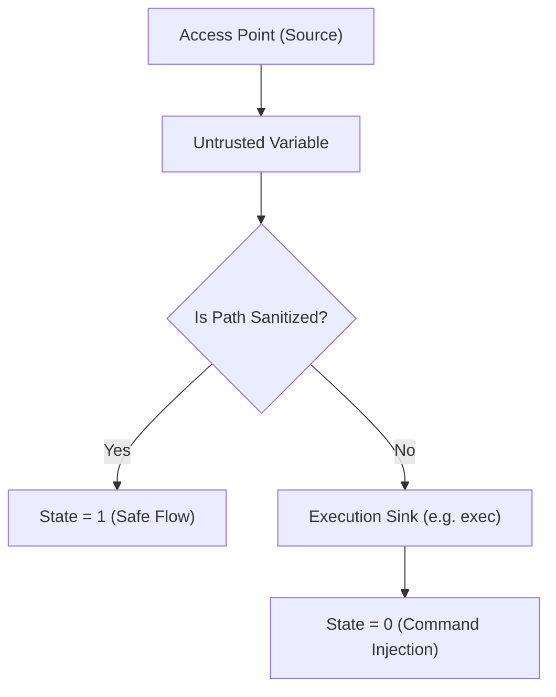

# Module 4: Security Math (Taint Flows)

## 1. Intent
Vulnerabilities are rarely a single line of bad code; they are a flow of tainted data. **Module 4 (Security Math)** tracks data injected at the Access Points (Module 1) and verifies if it travels to an Execution Sink (e.g., `exec()`, `query()`) without passing through a sanitization function. If the math proves an uninterrupted path exists, the system is fundamentally compromised.

---

## 2. The Mathematics (Reachability Matrix)
We define the application as an adjacency matrix $A$ where $A_{ij} = 1$ if data flows from node $i$ to node $j$. 
Let $S_{source}$ be the set of entry points, and $S_{sink}$ be the set of dangerous functions. 
A vulnerability exists if the boolean path existence $P(i, j)$ is true, and the path does not intersect the sanitization set $S_{clean}$:

$$ \exists (i, j) \in (S_{source} \times S_{sink}) \mid P(i, j) = 1 \land P(i, j) \cap S_{clean} = \emptyset $$

If true, **Wave Collapse (State = 0)**.

---

## 3. Architecture
Module 4 uses dynamic state mapping and semantic regular expressions. It tags variables at the perimeter and physically tracks their mutations across the Abstract Syntax Tree (AST) or memory space. When a sink is executed, the Engine checks the mathematical taint tag of the parameters.

---

## 4. Trade-Offs
### Advantages (Pros)
* **Kills Command Injection:** Absolutely lethal against SQLi, XSS, and OS Command Injection.
* **Semantic Awareness:** It understands that `a = b` means `a` is now tainted if `b` was tainted.

### Disadvantages (Cons)
* **False Positives (Custom Sanitizers):** If a developer writes a custom regex to sanitize data instead of using a standard framework library, Module 4 will not recognize it as $S_{clean}$ and will falsely trigger a Wave Collapse.
* **OOP Blindness:** Highly abstracted Object-Oriented paradigms (e.g., Dependency Injection, Interfaces) can hide data flows from the matrix, causing False Negatives.
