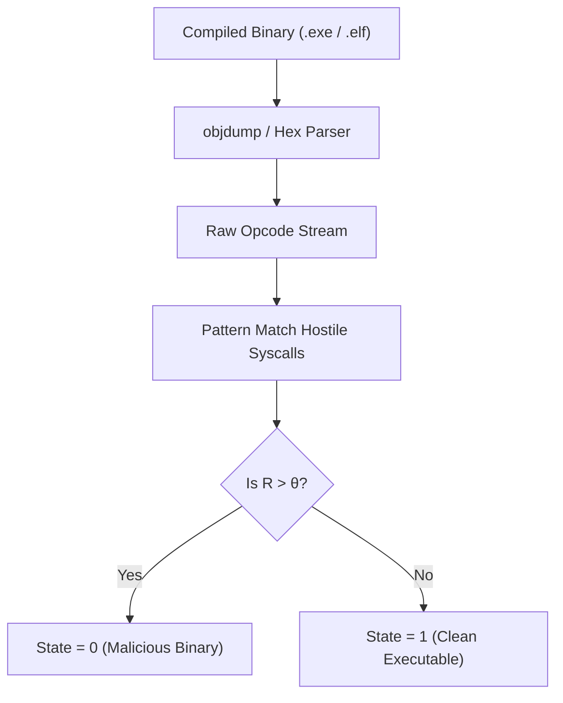

# Module 6: Binary Dissection (Hex/Assembly)

## 1. Intent
Compiled binaries (`.exe`, `.elf`, `.dll`) act as black boxes to standard linters. Attackers hide malicious instructions deep within compiled objects. **Module 6 (Binary Dissection)** forces open these black boxes. It disassembles compiled artifacts back into raw hexadecimal opcodes and assembly instructions to evaluate the physical CPU register manipulations for malicious signatures, all without actually executing the malware (Static Analysis).

---

## 2. The Mathematics (Malicious Instruction Ratio)
Let $I_{total}$ be the total number of physical CPU instructions in the disassembled binary. Let $I_{unsafe}$ be the number of instructions executing privileged or anomalous syscalls (e.g., `int 0x80`, `syscall`, `CreateRemoteThread` signatures).
The Malicious Instruction Ratio $R$ is:

$$ R = \frac{I_{unsafe}}{I_{total}} $$

If $R > \theta$ (where $\theta$ is the safety threshold), the binary is mathematically hostile.

---

## 3. Architecture
Module 6 utilizes OS-level toolchains (`objdump` / `readelf`) to rip the headers off compiled binaries and extract the `.text` executable sections. It pipes the raw hexadecimal opcodes into the Engine, which evaluates the bytecode against a known matrix of malicious memory injections and rootkit behaviors.

---

## 4. Trade-Offs
### Advantages (Pros)
* **Zero-Execution Safety:** Evaluates malicious software statically. Because the Engine never executes the binary, it cannot be infected by the malware it is analyzing.
* **Supply Chain Verification:** Capable of catching backdoored NPM/Cargo packages that ship with pre-compiled malicious `.node` or `.dll` files.

### Disadvantages (Cons)
* **Polymorphism / Encryption:** If the binary is packed (e.g., UPX) or heavily encrypted, there are no readable CPU instructions to analyze. (This is mitigated by handing the binary over to Module 3 for an Entropy collapse).
* **Massive CPU Overhead:** Disassembling a 1GB Unreal Engine binary into text-based assembly is computationally devastating and takes significant time.
