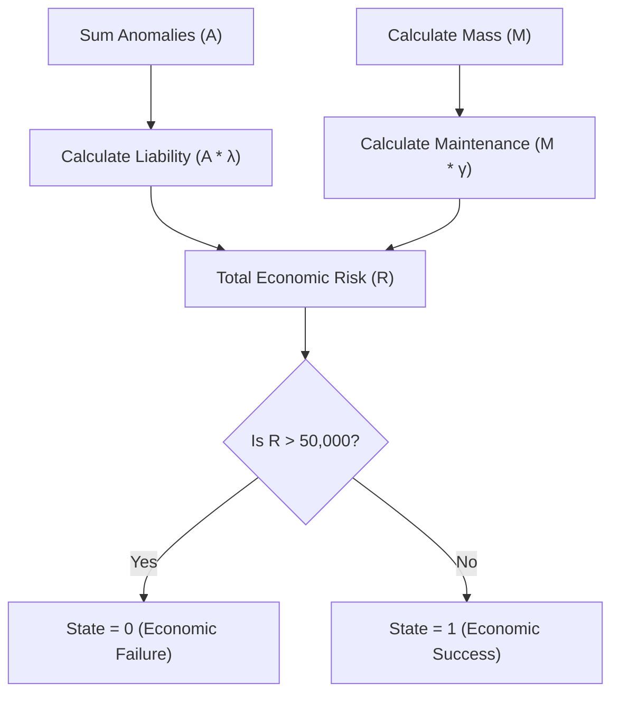

# Module 7: Tradeoff Analyser

## 1. Intent
In theoretical security, absolute safety is mathematically impossible without shutting off the computer entirely (The Halting Problem). Security is ultimately a business decision—a Cryptoeconomic equation. **Module 7 (Tradeoff Analyser)** calculates the exact financial liability of the detected anomalies and compares it against the physical maintenance cost of the codebase to determine if deploying the software is mathematically worth the risk.

---

## 2. The Mathematics (Cryptoeconomic Risk)
Let $A$ be the total count of unmitigated anomalies (Taint Flows, Temporal Leaks, High Entropy payloads).
Let $M$ be the physical mass of the codebase in Kilobytes.
Let $\lambda$ be the financial liability multiplier per anomaly (e.g., $10,000 for a potential breach).
Let $\gamma$ be the physical maintenance cost per KB of codebase (e.g., $0.05).

The Total Economic Risk $R_{total}$ is:

$$ R_{total} = (A \times \lambda) + (M \times \gamma) $$

If $R_{total} > \text{Value of Deployment}$, the system triggers an **ECONOMIC FAILURE** and halts the pipeline.

---

## 3. Architecture
Module 7 operates as the final Inference layer in the Node.js / C++ Orchestrator. It aggregates the state vectors outputted by Modules 1 through 6, multiplies them by the hardcoded financial liability limits, and produces a final deployment verdict. 

---

## 4. Trade-Offs
### Advantages (Pros)
* **Business Alignment:** Translates esoteric security vulnerabilities (like Timing Attacks) into raw financial metrics that executives can understand and act upon.
* **Objective Thresholds:** Removes human emotion from deployment decisions.

### Disadvantages (Cons)
* **Static Multipliers:** The liability multiplier ($\lambda$) is highly subjective. A SQL injection on a marketing blog is not financially equivalent to a SQL injection on a banking application, meaning $\lambda$ must be carefully calibrated per project.
