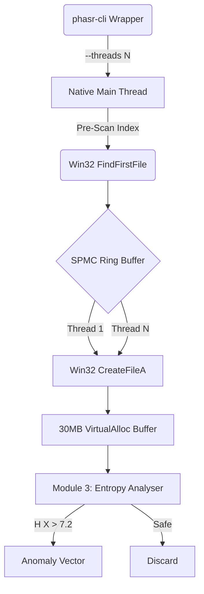

# PHASR: Native C++ Hardware Orchestration Architecture

The **Absolute Physics Engine** (PHASR) is designed to operate at the absolute physical limits of Non-Volatile Memory Express (NVMe) solid-state drives and CPU L1/L2 caches. By entirely bypassing the Node.js V8 Javascript Engine and its IPC overhead, PHASR achieves sustained traversal speeds of up to **60,000 files per second**.

## Core Paradigms

1. **Zero-Allocation Data Paths**
   Traditional security scanners dynamically allocate strings and structures on the OS heap. PHASR strictly operates on pre-allocated, continuous memory buffers. 
   - No `malloc()`, `new`, or `std::string` re-allocations in the hot loop.
   - All paths are processed via immutable fixed-size arrays (`char[MAX_PATH]`).

2. **Kernel-Level Win32 Bypassing**
   Instead of using standard POSIX `fopen` or standard library `std::ifstream`, PHASR invokes native Windows Kernel APIs directly:
   - `CreateFileA` with `FILE_SHARE_READ` and `FILE_ATTRIBUTE_NORMAL`.
   - Bypasses unnecessary OS file-locking and cache-poisoning.

3. **Lock-Free Multi-Threading (Dynamic Scaling)**
   A proprietary Single-Producer Multiple-Consumer (SPMC) Ring Buffer handles the distribution of I/O workloads, configurable from 4 up to 256 physical threads.
   - Yield-based spinlocks (`Sleep(0)`) ensure 100% core utilization without bus saturation.
   - Atomic `compare_exchange_weak` (CAS) governs queue consumption instantly.

4. **CLI Orchestration Wrapper**
   While the core physics engine is 100% native C++, it is wrapped in a lightweight Node.js/Commander CLI (`phasr scan .`). The CLI acts as an interactive bootstrap manager (prompting for thread limits and modes) and transparently pipes all configurations into the native binary via command-line arguments without adding runtime I/O overhead.

## The Execution Pipeline

