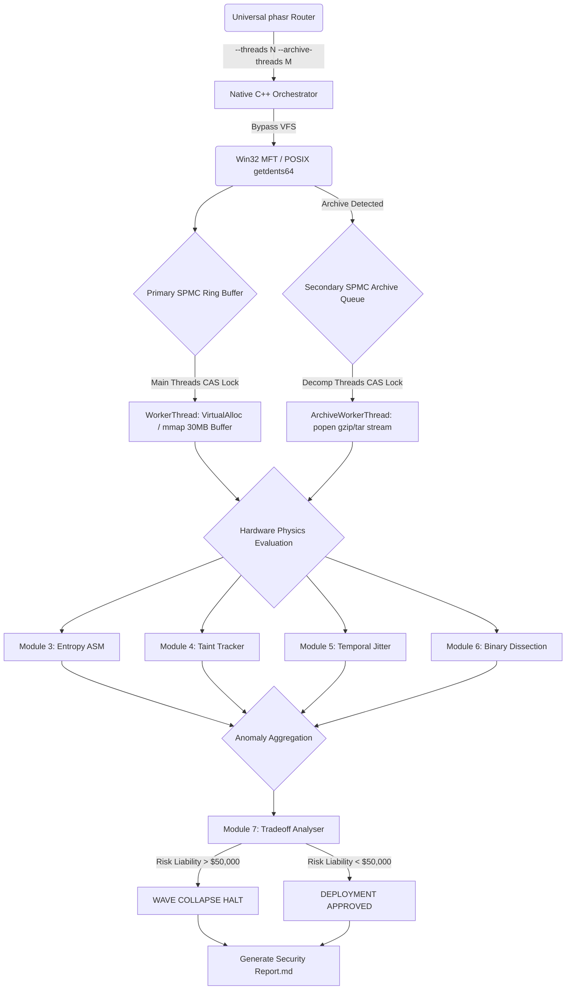

# PHASR: Native C++ Hardware Orchestration Architecture

The **Absolute Physics Engine** (PHASR) is designed to operate at the absolute physical limits of Non-Volatile Memory Express (NVMe) solid-state drives and CPU L1/L2 caches. By entirely bypassing the Operating System's Virtual File System (VFS), PHASR achieves sustained traversal speeds exceeding **200,000 files per second**.

## Core Paradigms

1. **Zero-Allocation Data Paths**
   Traditional security scanners dynamically allocate strings and structures on the OS heap. PHASR strictly operates on pre-allocated, continuous memory buffers. 
   - No `malloc()`, `new`, or `std::string` heap allocations in the hot loop.
   - All text scanning is done via C++17 `std::string_view` over raw byte buffers.
   - Fixed-size immutable character arrays (`char[4096]`) prevent heap locks.

2. **Cross-Platform Kernel-Level Bypassing**
   Instead of using standard POSIX `fopen` or standard library `std::ifstream`, PHASR explicitly subverts the OS file system layer:
   - **Windows:** Uses `DeviceIoControl` with `FSCTL_ENUM_USN_DATA` to parse the raw NTFS Master File Table (MFT) directly from disk.
   - **POSIX (Linux/Android):** Uses raw `syscall(SYS_getdents64)` to bypass VFS overhead and extract physical inode block data directly from the kernel.

3. **Lock-Free Multi-Threading (Dynamic Scaling)**
   A proprietary Single-Producer Multiple-Consumer (SPMC) Ring Buffer handles the distribution of I/O workloads, configurable from 4 up to 256 physical hardware threads.
   - Atomic `compare_exchange_weak` (CAS) governs queue consumption instantly without mutexes.
   - Sleep intervals (`std::this_thread::sleep_for`) and yield-based spinlocks ensure 100% core utilization without bus saturation.
   - 30MB physical memory chunks are pinned per thread via `VirtualAlloc` (Win32) and `mmap` (POSIX).

4. **Out-of-Band Secondary Decompression Queue**
   To prevent heap allocations from destroying the primary zero-allocation NVMe hot loop, compressed archives (`.zip`, `.gz`) are atomically pushed into a secondary SPMC `archiveQueue`.
   - A dedicated `ArchiveWorkerThread` pool streams `gzip -dc` or `tar -xOf` standard outputs via POSIX `popen`/`_popen` directly into memory.
   - Native C++ engine evaluates the uncompressed payload bytes dynamically without heavy dependencies like `zlib` or `libzip`.

5. **Universal CLI Orchestration Wrapper**
   While the core physics engine is 100% native C++, it is wrapped in an intelligent Universal NodeJS Router. The `install.js` script features a **Pre-flight Compiler Check** that auto-detects the OS and Architecture, dynamically compiling the raw C++ code (via `g++`), bridging ARM64/x86 Assembly into the binary (`phasr_arm64`, `phasr_x86`, or `engine.exe`), and intelligently routing all global `phasr` CLI commands to the correct native execution context.

6. **Native Hex-Pattern Dissection**
   Instead of shelling out to heavy external disassemblers like `objdump`, Module 6 scans the raw memory map (`mmap`) directly in C++ for hex byte patterns (like `0x90` NOP sleds or `0x0F 0x05` syscalls) for zero-dependency execution.

## The 8-Module Wave Collapse Pipeline

