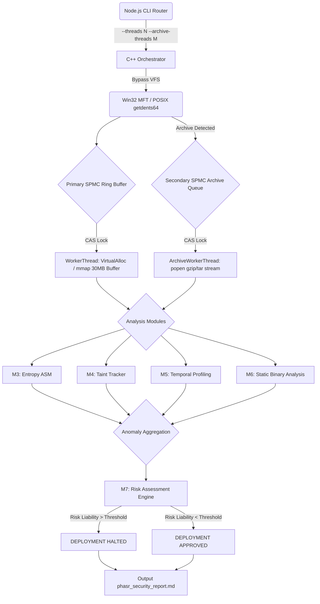

# PHASR: Systems Architecture

PHASR (Deterministic Engine for Vulnerability Management) is designed to operate at the physical limits of Non-Volatile Memory Express (NVMe) solid-state drives and CPU L1/L2 caches. By entirely bypassing the Operating System's Virtual File System (VFS), PHASR achieves sustained parallel traversal speeds exceeding 200,000 files per second.

## Core Paradigms

1. **Zero-Allocation Data Paths**
   Traditional scanners dynamically allocate objects on the OS heap. PHASR strictly operates on pre-allocated, contiguous memory buffers.
   - Elimination of `malloc()`, `new`, and `std::string` allocations in the hot loop.
   - Text scanning is executed via C++17 `std::string_view` over raw byte buffers.
   - Fixed-size immutable character arrays prevent heap locking and thread contention.

2. **Kernel-Level Traversal**
   PHASR subverts standard standard POSIX `fopen` and `std::ifstream` by interfacing directly with kernel disk APIs:
   - **Windows:** Uses `DeviceIoControl` with `FSCTL_ENUM_USN_DATA` to parse the NTFS Master File Table (MFT) directly.
   - **POSIX (Linux/Android):** Uses raw `syscall(SYS_getdents64)` to bypass VFS overhead and extract physical inode block data directly from the kernel.

3. **Lock-Free Multi-Threading (SPMC)**
   A Single-Producer Multiple-Consumer (SPMC) Ring Buffer handles the distribution of I/O workloads, scaling dynamically from 4 to 256 physical hardware threads.
   - Atomic `compare_exchange_weak` (CAS) manages queue consumption instantaneously without mutexes.
   - Pre-allocated 30MB physical memory chunks are pinned per thread via `VirtualAlloc` (Win32) and `mmap` (POSIX).

4. **Out-of-Band Secondary Decompression Queue**
   To prevent dynamic heap allocations from blocking the primary hot loop, compressed archives (`.zip`, `.gz`, `.tar`) are atomically pushed into a secondary SPMC `archiveQueue`.
   - A dedicated `ArchiveWorkerThread` pool streams `gzip -dc` or `tar -xOf` standard outputs via POSIX `popen`/`_popen` directly into memory.
   - The native C++ engine evaluates the uncompressed payload bytes dynamically without heavy dependencies like `zlib` or `libzip`.

5. **Cross-Platform Compilation**
   The core engine is wrapped in a universal Node.js router (`install.js`) that performs a pre-flight compiler check. It auto-detects the OS and Architecture, dynamically compiling the C++ code, bridging ARM64/x86 Assembly into the binary, and routing global CLI commands to the appropriate execution context.

6. **Static Binary Analysis**
   Module 6 scans the raw memory map (`mmap`) directly in C++ for hex byte sequences (such as `0x90` NOP sleds or `0x0F 0x05` syscalls), eliminating the need for external disassemblers.

## Pipeline Architecture

## Architectural Constraints & Future Optimizations

While PHASR operates at extreme speeds, several systems-level constraints are documented for future refactoring:

1. **Process Creation Overhead (`popen`):** 
   Currently, the `ArchiveWorkerThread` pool relies on POSIX `popen` to stream decompression. At scale, this triggers OS `fork()` overhead and risks PID exhaustion or Out-Of-Memory (OOM) crashes. Future iterations will embed `stb_zlib` or statically link `libarchive` for pure in-memory decompression.
   
2. **SIGBUS Traps on `mmap`:**
   Using zero-allocation `mmap` introduces a risk: if a target file is truncated by another process while PHASR is mapping the `std::string_view`, the OS will throw a `SIGBUS` signal. A `sigsetjmp` trap handler must be implemented to catch memory-mapping violations safely.
   
3. **Memory Bus Contention (Spinlocks):**
   The SPMC queue relies on `compare_exchange_weak` spinlocks. Under heavy contention across 256 threads, preemption can cause severe memory bus saturation. A transition to exponential backoff algorithms or lightweight `std::condition_variable` (futexes) is planned.
   
4. **Anomaly Aggregation Bottlenecks:**
   Appending to the shared anomaly vector currently relies on a single Mutex (`lock(printCS)`). During mass-detection events, this creates a thread-serialization bottleneck. Future architectures will implement thread-local lock-free queues that aggregate upon completion.
   
5. **Time-of-Check to Time-of-Use (TOCTOU) Security:**
   Bypassing the VFS via `getdents64` decouples directory traversal from the subsequent `open()` call. This introduces a microsecond TOCTOU window where a malicious process could swap a file or symlink before the worker thread acquires the file handle.
