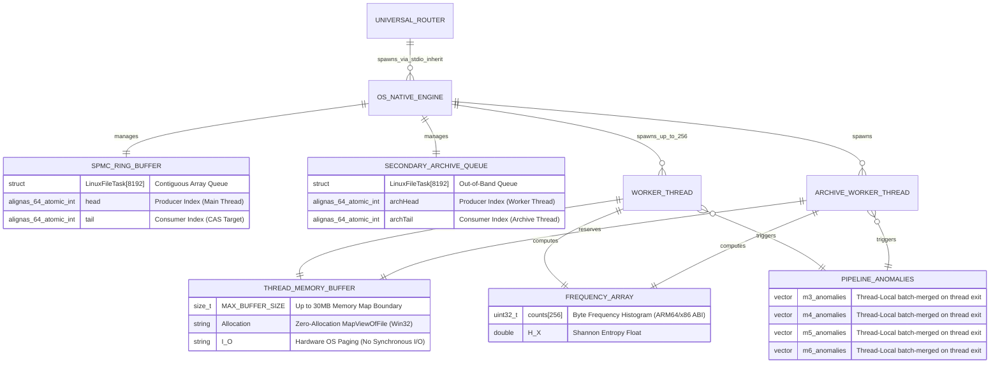

# PHASR Data Flow & Inter-Process Communication

This document visualizes the execution lifecycle and memory structures within the PHASR architecture, tracing data transitions from the Command-Line Router to the Windows NTFS (MFT) and Linux (getdents64) kernel boundaries.

## 1. Cross-Platform Execution Sequence
The following sequence diagram traces the chronological execution path of a codebase scan. The Node.js CLI dynamically routes execution to the natively compiled OS-specific binary, entirely detaching itself from the hot path.

```mermaid
sequenceDiagram
    autonumber
    actor User
    participant CLI as Node.js Universal Router
    participant Main as C++ Orchestrator (Main Thread)
    participant Buffer as Primary SPMC Ring Buffer
    participant ArchBuffer as Secondary Archive Queue
    participant Worker as Primary Worker Threads
    participant ArchWorker as Archive Decomp Threads
    participant Kernel as Win32 (MFT) / POSIX (getdents64)

    User->>CLI: `phasr . --threads 64 --archive-threads 4`
    CLI->>CLI: Strictly route via `process.platform` & `process.arch`
    CLI->>Main: Execute Native Binary (`engine.exe`, `phasr_arm64`, `engine`)
    
    rect rgb(20, 40, 20)
        Note over Main, Kernel: KERNEL-BYPASS ZERO-ALLOCATION HOT LOOP
        Main->>Main: Resolve targetDir to Absolute Path (In-Memory MFT Tree)
        Main->>Kernel: Request USN Journal & Enumerate Master File Table
        Kernel-->>Main: Raw Directory/File Handlers
        Main->>Buffer: Store Path in `fileQueue[head]`
        Main->>Buffer: std::atomic `head++` (Release Semantics)
        
        Buffer-->>Worker: Spinlock acquires `tail` (Compare-And-Swap)
        Worker->>Kernel: OpenFileById (using pre-resolved FRN)
        Worker->>Kernel: CreateFileMappingA / MapViewOfFile (up to 30MB map)
        Kernel-->>Worker: OS Memory Manager hands direct zero-allocation pointer
        
        alt is Compressed (.zip, .gz, .tar)
            Worker->>ArchBuffer: Push to `archiveQueue[archHead]` (Out-of-band)
            ArchBuffer-->>ArchWorker: CAS Pop `archTail`
            ArchWorker->>Kernel: Native In-Memory ZLIB DEFLATE (#ifdef) / popen
            Kernel-->>ArchWorker: Decompressed stream mapped directly to memory
            ArchWorker->>ArchWorker: M3 (Entropy): Analyze Unpacked Payload
        else is Standard File
            par Concurrent Analysis Modules
                Worker->>Worker: M3 (Entropy): Calculate Shannon H(X)
                Worker->>Worker: M4 (Taint): Scan std::string_view for injections
                Worker->>Worker: M5 (Temporal): clock_gettime / GetTickCount drift detection
                Worker->>Worker: M6 (Dissection): Static Binary Analysis (NOP Sleds)
            end
        end
        
        alt Module Triggered Anomaly
            Worker->>Worker: Lock-Free Push to Thread-Local vector
            ArchWorker->>ArchWorker: Lock-Free Push to Thread-Local vector
        end
    end
    
    Main->>Main: Batch Merge Thread-Local vectors into Global Anomaly List
    
    Main->>Main: M7 (Risk Assessment): Compute Liability vs Total Size
    Main->>User: Output Clean Summary & write `phasr_security_report.md`
```

---

## 2. Entity-Relationship (Memory Topology) Diagram
At extreme throughput speeds, typical object-oriented structures trigger catastrophic heap fragmentation and thread contention. PHASR models its memory entirely as statically sized contiguous memory blocks mapped to CPU Cache lines, utilizing zero-allocation `std::string_view` structures.

The following ER diagram maps the relationships of memory structures across OS targets:

