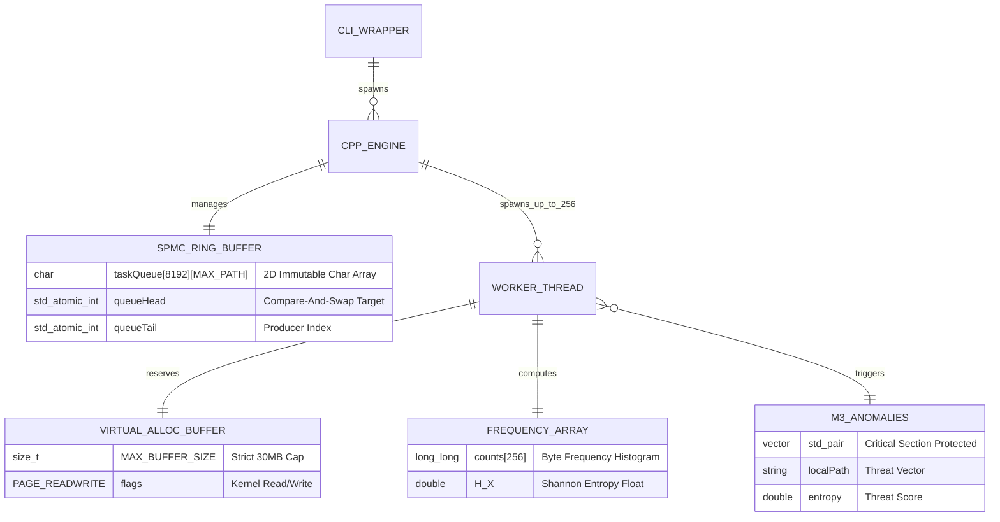

# PHASR Data Flow & Relationships

This document visualizes the exact physical lifecycle of payload processing within the PHASR ecosystem, mapping how data transitions from the Command-Line Wrapper down into the Windows Kernel and CPU Caches.

## 1. Execution Sequence Flow
The following sequence diagram traces the chronological execution path of a file being scanned. Notice how the Node.js CLI entirely detaches from the hot path after bootstrapping, allowing the C++ engine to perform zero-allocation hardware execution.

```mermaid
sequenceDiagram
    autonumber
    actor User
    participant CLI as Node.js Wrapper
    participant Main as C++ Main Thread
    participant Buffer as SPMC Ring Buffer
    participant Worker as C++ Worker Thread
    participant Kernel as Win32 Kernel (NTFS)

    User->>CLI: `phasr scan C:\`
    CLI->>CLI: Prompt for Thread Limit (e.g., 32)
    CLI->>Main: `spawnSync(engine.exe, ["--threads", 32])`
    
    rect rgb(20, 40, 20)
        Note over Main, Kernel: ZERO-ALLOCATION HOT LOOP
        Main->>Kernel: FindFirstFileA(C:\)
        Kernel-->>Main: MFT Entry (File Path)
        Main->>Buffer: Store Path in `taskQueue[queueTail]`
        Main->>Buffer: std::atomic `queueTail++`
        
        Buffer-->>Worker: Spinlock acquires `queueHead` (CAS)
        Worker->>Kernel: CreateFileA(File Path)
        Worker->>Kernel: ReadFile(up to 30MB)
        Kernel-->>Worker: Physical Bytes mapped to 30MB VirtualAlloc Buffer
        Worker->>Worker: Calculate Shannon Entropy H(X) via ASM
        
        alt H(X) > 7.2
            Worker->>Main: push_back(m3_anomalies)
        end
    end
    
    Main->>User: Generate `phasr_security_report.md`
```

---

## 2. Entity-Relationship (Memory Physics) Diagram
At extreme throughput speeds (60k f/s), typical object-oriented structures trigger catastrophic heap fragmentation. PHASR models its memory entirely as statically sized contiguous C-arrays mapped to CPU Cache lines. 

The following ER diagram maps the physical relationships of the memory structures:

