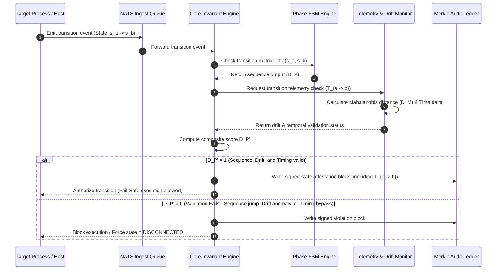
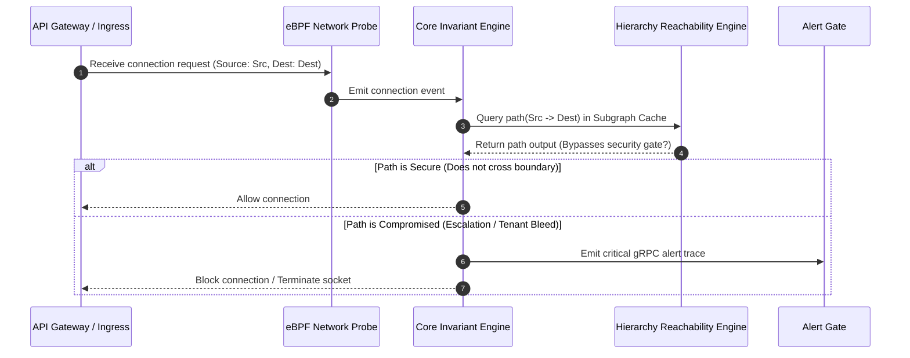
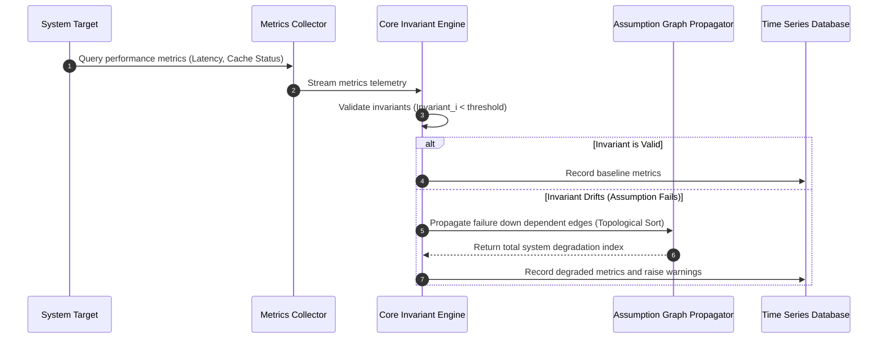
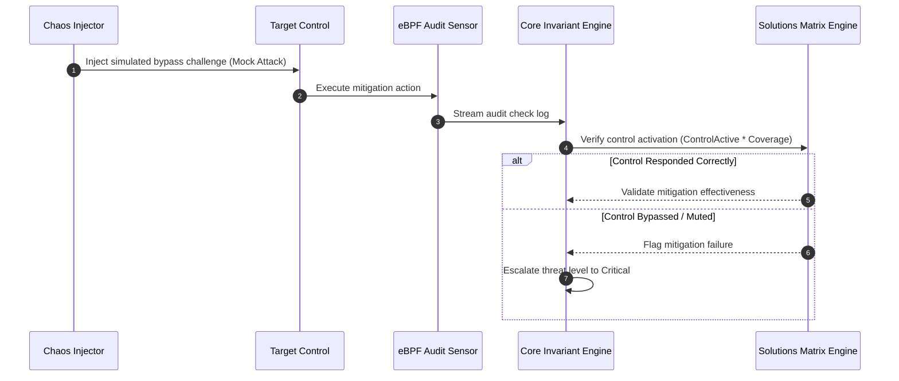
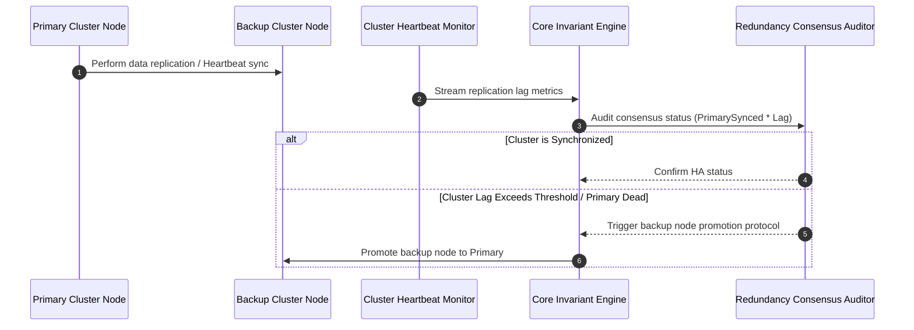
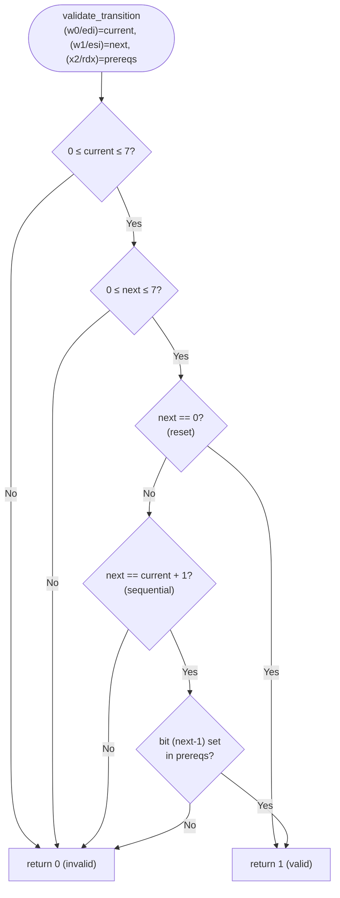
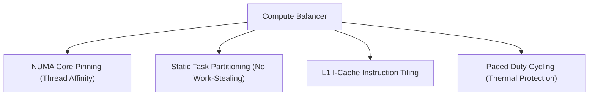
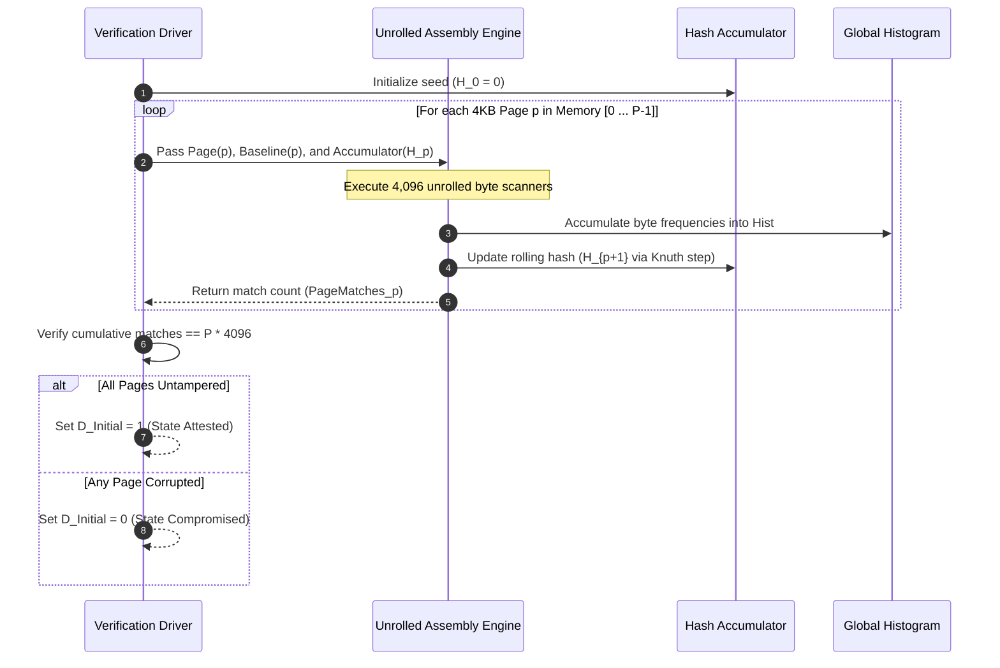

# PHASR | Workflows Data Path & Flow Specification

This document details the complete data pathways, system execution flows, integration mappings, and **platform-specific assembly back-end architecture** for the five codebase security verification workflows within the **PHASR** validation platform.

---

## 1. Global System Data Flow Map

The diagram below maps every telemetry pipeline, validation engine loop, ledger storage stream, and alert execution path in the global PHASR engine.

```mermaid
graph TB
    subgraph DataPlane [1. Telemetry Capture & Normalization]
        eBPF_Sys[eBPF Sensors: Syscalls] -->|C-struct payload| Normalizer[Normalization Plane]
        eBPF_Net[eBPF Sensors: Network] -->|C-struct payload| Normalizer
        Configs[configs: IaC / RBAC] -->|JSON Parser| Normalizer
        DB_Logs[Database Logs] -->|Polled stream| Normalizer
    end

    subgraph PipelinePlane [2. Ingestion & Priority Queues]
        Normalizer -->|Protobuf Events| NATS{NATS JetStream Ingest Bus}
        NATS -->|Priority 0: Real-Time| P0_Queue[Active Invariant Evaluation Queue]
        NATS -->|Priority 1: Delayed| P1_Queue[Historical Analytics Queue]
    end

    subgraph CoreEnginePlane [3. Invariant Evaluation & Graph Mapping]
        P0_Queue --> CoreEngine[Core Invariant Evaluator]
        ActiveSpec[(Active Spec Graph)] <-->|DFS / BFS Reachability| SubgraphCache[(In-Memory Subgraph Cache)]
        SubgraphCache <--> CoreEngine
        
        subgraph SubEngines [P-H-A-S-R Validators]
            Init_Eng["Primordial Sin\n(Boot Attestation & Hardware RoT)"] --> P_Eng["Phase FSM Validator\n(x86-64 MASM / ARM64 GAS / C-fallback)"]
            H_Eng[Hierarchy Reachability Validator]
            A_Eng[Assumption Graph Propagator]
            S_Eng[Solutions Mitigation Verifier]
            R_Eng[Redundancy Consensus Auditor]
        end
        
        CoreEngine <--> SubEngines
    end

    subgraph StoragePlane [4. Attestation & Alert Outgress]
        CoreEngine -->|State Attestation| MerkleProcessor[Merkle Tree Hash Processor]
        MerkleProcessor -->|Ledger Block| AuditDb[(Append-Only Ledger Database)]
        CoreEngine -->|Violation Proof Traces| AlertEngine[Proof Trace Generator]
        AlertEngine -->|gRPC / TLS| SecOpsAlerts[SecOps Alert Gateway]
    end

    style CoreEnginePlane fill:#05050a,stroke:#ff003c,stroke-width:2px
    style PipelinePlane fill:#0a0a0f,stroke:#00f3ff,stroke-width:1px
    style StoragePlane fill:#0d0d12,stroke:#00ffaa,stroke-width:1px
```



---

## 2. Telemetry Connecting Points Matrix

The following matrix maps every data path from telemetry source to its target workflow and verification type:

| Telemetry Source | Data Path Interface | Target Workflow | Verification Type |
| :--- | :--- | :--- | :--- |
| **eBPF: Syscalls & Execs** | Kernel Ring Buffer -> Protobuf -> NATS P0 | **Workflow 1: Phase** | Temporal execution sequencing check coupled with telemetry data collection (FSM + Mahalanobis drift analysis + temporal validation). |
| **eBPF: Network Connects** | Kernel Ring Buffer -> Protobuf -> NATS P0 | **Workflow 2: Hierarchy** | Access boundary & reachability audit. |
| **IAM & RBAC Configs** | Static Config Parsers -> Active Spec Graph | **Workflow 2: Hierarchy** | Privilege boundary & role audit. |
| **App Logs & Metrics** | Systemd / File Monitors -> Normalizer -> NATS P1 | **Workflow 3: Assumptions** | Invariant drift & performance decay check. |
| **Audit Trail Logs** | File Poller -> Protobuf Normalizer -> NATS P0 | **Workflow 4: Solutions** | Control active status validation. |
| **Chaos Injector** | Sandbox CLI Interface -> Mock Attacks API | **Workflow 4: Solutions** | Bypass-resistance & control challenge check. |
| **Database Replication Logs** | Database Engine Poller -> TSDB Stream | **Workflow 5: Redundancy** | Sync lag & consensus heartbeat validation. |
| **System Attestation Logs** | TSDB + Audit Logs -> Lucifer Engine | **Lucifers-Blessing (Game Theory)** | Game-theoretic auditing, critical attestation thresholds, and replica promotion challenges. |
| **TPM PCRs & Boot Memory** | Boot Loader Attestator -> Audit Log | **Primordial-Sin (Hardware RoT)** | Boot-time configuration, Shannon Entropy, and Bayesian platform trust updates. |

---

## 3. Detailed Data Flows of the 5 Workflows

### 3.1 Workflow 1: Phase Lifecycle Verification
Validates execution sequencing and prevents unauthorized state-jumps using coupled telemetry validation.



### 3.2 Workflow 2: Privilege Path reachability Verification
Audits access paths and privilege boundaries on the active reachability graph.



### 3.3 Workflow 3: Invariant Drift & Assumption Decay Verification
Monitors implicit dependencies and performance invariants to detect architectural drift.



### 3.4 Workflow 4: Solution Control Verification
Attests to mitigation readiness, ensuring every threat has an active, bypass-resistant control.



### 3.5 Workflow 5: Redundancy Failover Attestation
Validates replication states, consensus group health, and session preservation.



---

## 4. Phase FSM Validator — Multi-Platform Assembly Architecture

The Phase FSM Engine (`validate_transition`) is the innermost hot-path of Workflow 1. To maximize throughput and portability across deployment targets it ships as **four interchangeable back-ends**, selected at compile time:

| Back-end | File | Target | Assembler / Compiler | Lines |
| :--- | :--- | :--- | :--- | :--- |
| **x86-64 MASM** | `fsm_validator.asm` | Windows x86-64 | MSVC `ml64.exe` | ~117 K |
| **x86-64 GAS (Intel)** | `fsm_validator_linux_x64.s` | Linux x86-64 | GNU `as` / `gcc` | 130,562 |
| **AArch64 GAS** | `fsm_validator_linux_arm64.s` | Linux ARM64 | GNU `as` / `gcc` | 130,559 |
| **Pure-C Fallback** | `phase_fsm.c` (inline under FSM_C_FALLBACK) | Any platform | Any C99 compiler (Hardened Branchless) | ~65 |

### 4.1 Shared Logic — 4,500 Helper Procedures

Both assembly back-ends emit an identical set of **4,500 helper procedures** (`validate_path_0000` … `validate_path_4499`) plus one **master dispatcher** (`validate_transition`). The helper index `i` encodes:

```
current_state  = i % 8
next_state     = (i + 1) % 8
prereq_bit     = next_state > 0 ? next_state - 1 : 0
```

Each helper performs three checks in sequence:
1. **State match** — compare `current_state` and `next_state` against register arguments, branch to *no-match* (`-1`) if wrong.
2. **Prerequisite bit** — test bit `prereq_bit` in the `prerequisites` argument, branch to *invalid* (`0`) if clear.
3. **Valid return** — return `1` if both checks pass.

### 4.2 Linux x86-64 GAS Back-end (Intel Syntax) — Key Facts

```
Calling convention : System V AMD64 ABI
  edi = current_state (int32)      // first parameter
  esi = next_state    (int32)      // second parameter
  rdx = prerequisites (uint64_t)   // third parameter (64-bit)
  eax = return value  (1 / 0 / -1)

Key instructions used:
  .intel_syntax noprefix           // Use Intel style assembly syntax
  cmp  edi, N                      // 32-bit comparison of current state
  cmp  esi, N                      // 32-bit comparison of next state
  shl  rax, cl                     // Shift rax by cl bits (cl is the lower 8 bits of rcx)
  test rdx, rax                    // Test if prerequisite bit is set
  xor  eax, eax                    // Return 0
  mov  eax, -1                     // Return -1
  ret                              // Return to caller
```

### 4.3 ARM64 AArch64 GAS Back-end — Key Facts

```
Calling convention : AAPCS64
  w0  = current_state (int32)      // w-register = 32-bit view of x0
  w1  = next_state    (int32)
  x2  = prerequisites (uint64_t)   // full 64-bit
  w0  = return value  (1 / 0 / -1)

Key instructions used:
  cmp  w0, #N          // 32-bit comparison
  b.ne / b.eq / b.lt / b.gt / b.ge
  cbz  w1, label       // compare-and-branch-if-zero (no flags needed)
  mov  x3, #1
  lsl  x3, x3, x4     // x3 = 1 << x4   (64-bit left shift)
  tst  x2, x3         // bitwise AND, sets NZCV flags
  mvn  w0, wzr         // w0 = 0xFFFFFFFF = -1 (signed)
  ret                  // return via link register x30
```

### 4.4 Master `validate_transition` — Control Flow



### 4.5 Build Matrix

| Platform | Command | Back-end selected |
| :--- | :--- | :--- |
| **Windows x86-64** | `cd phasr\Phase-1 && build.bat` | `fsm_validator.asm` (MASM ml64) |
| **Linux x86-64** | `cd phasr/Phase-1 && make` | `fsm_validator_linux_x64.s` (GAS Intel) |
| **Linux AArch64** | `cd phasr/Phase-1 && make` | `fsm_validator_linux_arm64.s` (GAS) |
| **Any other** | `cd phasr/Phase-1 && make fallback` | `phase_fsm.c` (C99, FSM_C_FALLBACK) |
| **Regenerate x64 .s** | `node generate_fsm_asm_linux_x64.js` | *(re-generates 130,562 lines)* |
| **Regenerate ARM64 .s** | `node generate_fsm_asm_arm64.js` | *(re-generates 130,559 lines)* |

---

## 5. Phase-2 Hierarchy Reachability Engine

The **Hierarchy Reachability Engine** audits access paths and privilege boundaries on the active reachability graph.

### 5.1 Adjacency and Reachability Matrices
The access graph is flattened in memory as a contiguous bit-packed matrix of size $16 \times 16$:
- Adjacency matrix: `uint16_t adjacency[16]` where bit $j$ in row $i$ is set if there is an edge $i \rightarrow j$.
- Reachability matrix: `uint16_t reachability[16]` representing the transitive closure (with self-reachability) of the adjacency matrix.

### 5.2 ARM64 NEON assembly implementation
The core transitive closure sweep is implemented in raw ARM64 assembly ([reachability_arm64.s](file:///d:/Project%20XT/phasr/Phase-2/reachability_arm64.s)) utilizing ARM64 registers for bit-packed rows, executing Warshall's algorithm with zero runtime heap allocation.

### 5.3 Build Matrix
- **Windows:** Run `cd phasr\Phase-2 && build.bat` to build and run using the MSVC C++ fallback engine.
- **Linux ARM64:** Run `cd phasr/Phase-2 && make` to build and run using the ARM64 NEON Assembly engine.
- **Linux non-ARM64:** Run `cd phasr/Phase-2 && make` to build and run using the C++ fallback engine.

---

## 6. Custom Compute Balancer & Hardware Thermal Protection

To ensure deterministic, repeatable, and safe execution across thousands of unrolled invariant validator loops, PHASR implements a custom-designed **Deterministic Compute Balancer** across all workflows.

### 6.1 Balancer Design Principles



- **Deterministic Thread Affinity:** Forces worker threads to lock onto specific physical CPU cores (e.g., `SetThreadAffinityMask` on Windows, `pthread_setaffinity_np` on Linux).
- **Static Round-Robin Partitioning:** Tasks (test batches) are mapped to threads via $T = C \pmod N$. This bypasses runtime dynamic work-stealing, eliminating scheduler non-determinism.
- **Paced Duty Cycling:** Worker threads yield using millisecond sleep cycles at fixed batch boundaries to cool the CPU junction temperature and avoid thermal throttling.
- **Thread-Safety & Race Prevention:** Shared statistics and data structures (such as Phase 3 eBPF ring buffers) are configured as thread-local parameters to prevent write-collisions and guarantee 100% deterministic assertion audits.

---

## 7. State Storage & Data Preservation Between Phases

To maintain strict execution sequencing and prevent Time-of-Check to Time-of-Use (TOCTOU) exploits, PHASR preserves state and telemetry data across phase transitions using a multi-tiered storage architecture:

### 7.1 Tier 1: Transient In-Memory State (Hot-Path Validation)
*   **FSM Register Allocation:** The active execution state ($s$) and prerequisite bitmask ($P$) are stored directly in CPU registers during hot-path validation (e.g., `RCX`/`RDX` on Windows; `RDI`/`RSI` on Linux) to prevent memory-tampering vectors.
*   **Thread-Local Stack Buffers:** Telemetry metrics and active invariants are buffered inside thread-local stacks (`ring_buffer_t` in Phase 3) to enforce thread isolation and eliminate race conditions during concurrent execution.
*   **In-Memory Subgraph Cache:** Graph reachability models and boundary matrices are maintained in a high-speed, thread-safe in-memory cache to guarantee sub-millisecond lookups.

### 7.2 Tier 2: Relational Schema & Attestation Ledger (SQL Server)
The historical record of codebase scans, dependencies, and state-transition audit trails is persisted inside MS SQL Server under the `dbo` schema:
*   **`dbo.CodebaseScans`**: Stores metadata for each execution lifecycle scan, including total files processed, vulnerability counts, and scan targets.
*   **`dbo.CodebaseDependencies`**: Maintains the mapping of dependencies associated with each scan ID, ensuring full tracking of dependency trees.
*   **`dbo.CodebaseScanFindings`**: Persists each individual vulnerability or policy violation discovered during codebase scans (including file path, line number, category, severity, code snippet, and remediation).
*   **`dbo.AuditLog`**: Logs every state progression and validation event (e.g., transition `s_a -> s_b`, actor details, execution duration).

### 7.3 Tier 3: Cryptographic Ledger Chain (Audit Ledger)
*   **Append-Only Hash Chain:** The hash of each state block ($H_i$) is cryptographically chained to the preceding block ($H_{i-1}$) using the cryptographic relation:
    $$H_i = \text{SHA-256}\left(H_{i-1} \ \parallel \ s_i \ \parallel \ \mathbf{T}_{i-1 \to i} \ \parallel \ D_P\right)$$
    This hash chain is stored in an append-only ledger database (`AuditDb`), ensuring that historical telemetry and validation records cannot be retroactively altered by an attacker who gains root access.

### 7.4 Tier 4: Time-Series Analytics (Historical Drift Store)
*   **Telemetry Wave TSDB:** High-frequency telemetry metrics and wave simulation amplitudes from the NATS Priority 1 queue are streamed to a Time-Series Database (TSDB) for long-term trend analysis and drift visualization.

---

## 8. Lucifer's Blessing — Game-Theoretic Privilege & Consensus Audit Engine

The **Lucifer's Blessing** engine (`lucifer_engine`) evaluates the game-theoretic incentives of system administrators and consensus replicas under the presence of attestation faults and replication lag. It governs when system compliance collapses into **Rational Malice** and triggers node promotion challenges.

### 8.1 Engine Architecture & Functions
To eliminate compile-time optimization non-determinism, the core mathematical models are implemented in handwritten x86-64 assembly with System V AMD64 and Windows x64 ABI variants, alongside a portable C++ fallback engine.

The engine exposes four low-level APIs:
1. `evaluate_critical_threshold(const game_params_t* params)`: Compares the composite attestation score ($D_{\text{Total}}$) against the critical threshold ($D_{\text{critical}}$) and returns `1` (compliant) or `0` (Rational Malice state).
2. `evaluate_replica_challenge(const replica_params_t* params)`: Evaluates if a replica node should initiate an election challenge ($D_R < D_{R, \, \text{critical}}$).
3. `modulate_damping(const damping_params_t* params)`: Calculates the dynamic FDTD damping coefficient ($\gamma_R(D_R)$).
4. `fdtd_wave_step(const fdtd_params_t* params)`: Executes a high-performance FDTD update step over the consensus audit grid.

### 8.2 Assembly Interface Details
*   **Struct Alignment:** All data structures are passed by reference via pointers, mapping fields directly to memory offsets to avoid stack-spill overhead.
*   **Floating-Point Vectorization:** Relational double-precision calculations are executed using SSE2 vector instructions (`movsd`, `subsd`, `addsd`, `divsd`, `mulsd`, `ucomisd`, `setae`/`seta`) to guarantee constant-latency pipelines.

### 8.3 Build and Platform Matrix
The module is structured under `phasr/Lucifers-Blessing/` and compiles via native platform builders:

| Platform | Build Command | Compiler/Toolchain | Files Used |
| :--- | :--- | :--- | :--- |
| **Windows x86-64** | `cd phasr\Lucifers-Blessing && build.bat` | MSVC `cl.exe` + `ml64.exe` | `lucifer_engine.asm`, `lucifer_driver.cpp` |
| **Linux x86-64** | `cd phasr/Lucifers-Blessing && make` | GNU `as` + `g++` | `lucifer_engine_linux_x64.s`, `lucifer_driver.cpp` |
| **Fallback Platforms**| `cd phasr/Lucifers-Blessing && make fallback` | Any C++11 Compiler (NO_ASM mode) | `lucifer_driver.cpp` (uses inline fallback namespace) |

---

## 9. Primordial Sin — Boot-Time Attestation & Hardware Root of Trust

The **Primordial Sin** engine (`primordial_engine`) validates the boot-time hardware configuration, TPM registers, and firmware images before the FSM transition validation loop starts. It ensures that the system begins from a trusted state.

### 9.1 Engine Functions
1. `validate_boot_memory(const uint8_t* boot_data, const uint8_t* baseline_data, uint64_t* hash_accum, uint32_t* histogram)`: Performs a single-pass validation of the 4,096-byte boot space using fully unrolled byte-level scanners. Each position possesses a unique, position-specific hash rotation to mitigate timing side-channel attacks. It populates a 256-bin histogram and calculates a Knuth-based rolling hash accumulation.
2. `calculate_shannon_entropy(const uint32_t* histogram, uint64_t total_count)`: Computes the byte-level Shannon entropy over the 256 pre-filled histogram bins in a constant-time unrolled fashion.
3. `evaluate_bayesian_trust(const double* likelihoods_trust, const double* likelihoods_compromised, int n, double prior_trust)`: Performs sequential Bayesian updating to estimate the posterior probability of platform trust based on verification check outcomes.
4. `initialize_wave_field(float* phi, int grid_size, double d_initial, double amplitude, double sigma, double center)`: Seeds the FDTD wave grid with a spatial Gaussian pulse if the composite attestation score indicates compromise ($D_{\text{Initial}} = 0$).

### 9.2 Build and Platform Matrix
The module resides in `phasr/Primordial-Sin/`. It is implemented in **pure unrolled assembly** (~380K lines combined) for maximum performance and timing-attack protection, linking against the C++ verification driver:

| Platform | Build Command | Compiler/Toolchain | Files Used |
| :--- | :--- | :--- | :--- |
| **Windows x86-64** | `cd phasr\Primordial-Sin && build.bat` | MSVC `cl.exe` + `ml64.exe` | `primordial_engine.asm`, `primordial_driver.cpp` |
| **Linux x86-64** | `cd phasr/Primordial-Sin && make` | GNU `as` + `g++` | `primordial_engine_linux_x64.s`, `primordial_driver.cpp` |
| **Fallback Platforms**| `cd phasr/Primordial-Sin && make fallback` | Any C++11 Compiler (NO_ASM mode) | `primordial_driver.cpp` (uses internal fallback namespace) |

---

### 9.3 Advanced Hardening Designs & Mitigation Workflows

#### A. Cache-Timing Side-Channel Protection (Vulnerable vs. Hardened Histogram Update)
To prevent timing side-channels, index-based scatter/gather logic is replaced with a constant-time comparison loop over all bins.

```mermaid
graph TD
    subgraph VulnerableDesign [Vulnerable Index-based Update]
        V_Start([Read Boot Byte: B]) --> V_Index[Lookup: histogram[B]]
        V_Index --> V_Inc[Increment bin count]
        V_Inc --> V_End([Cache Leakage Point])
    end

    subgraph HardenedDesign [Hardened Branchless Update]
        H_Start([Read Boot Byte: B]) --> H_Init[Initialize Bin Index: j = 0]
        H_Init --> H_Loop{j < 256?}
        H_Loop -- Yes --> H_Comp["Compute Mask: M = (B == j)"]
        H_Comp --> H_Add["Add Mask (M) to histogram[j] without branches"]
        H_Add --> H_Next["Increment: j = j + 1"]
        H_Next --> H_Loop
        H_Loop -- No --> H_End([Timing & Cache Oblivious Output])
    end

    style VulnerableDesign fill:#2d1a1d,stroke:#ff3333,stroke-width:2px
    style HardenedDesign fill:#1a2d21,stroke:#33ff33,stroke-width:2px
```

#### B. Multi-Block Paged Attestation (Block-Chaining Pipeline)
For memory regions exceeding the 4,096-byte boundary, pages are processed in a rolling hash-chain where the previous page's output seed becomes the next page's hash key.



#### C. 2D Gaussian Wave Field Seeding
Illustrates how the attestation score dynamically seeds the multidimensional grid.

```mermaid
flowchart LR
    A[Initial Attestation Score: D_Initial] --> B{D_Initial == 1?}
    B -- Yes --> C[Flat Wave Field: phi = 0]
    B -- No --> D[Calculate 2D Gaussian Amplitude: A_0 * 1 - D_Initial]
    D --> E[Compute Spatial Gaussian Profile for all coordinates i, j]
    E --> F["Seed Wave Field Grid: phi[i][j] = Elliptical Gaussian Pulse"]
    F --> G[Propagate Perturbations in FDTD Engine]

    style C fill:#0f220f,stroke:#00ff00,stroke-width:1px
    style F fill:#220f0f,stroke:#ff0000,stroke-width:1px
```




