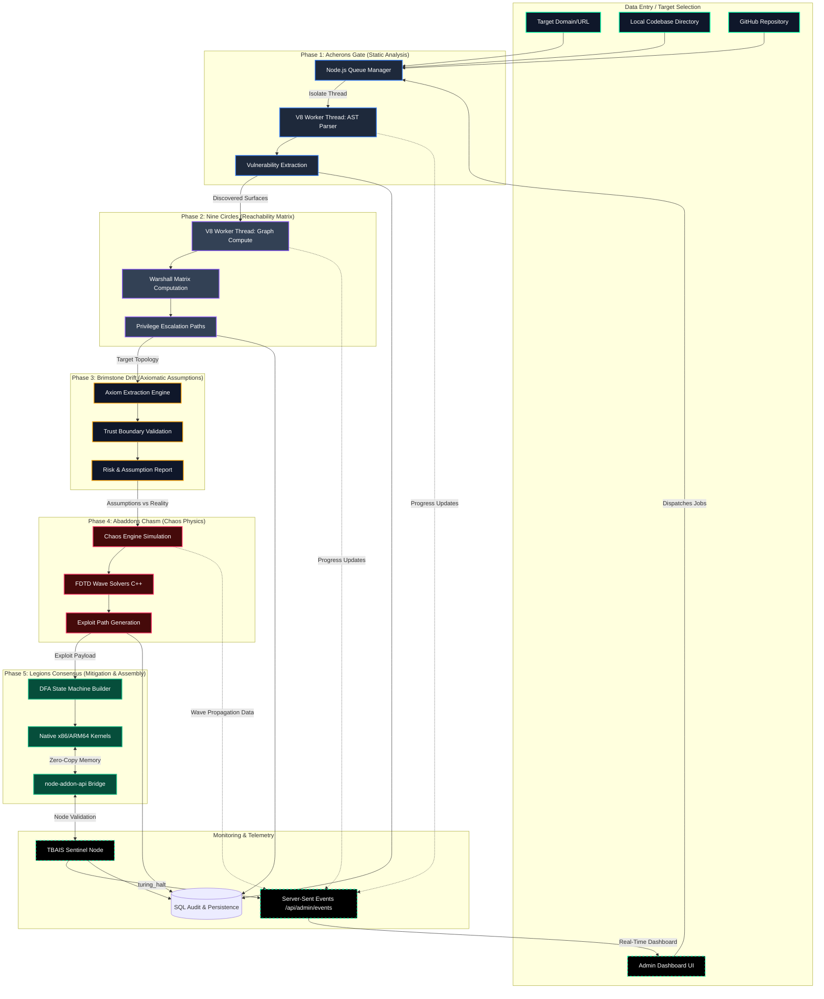

# PHASR: Speed & Balance Architecture

The core philosophy of the PHASR backend architecture is **Maximum Execution Speed** fused with **Ecosystem Balance**. We rely heavily on native APIs (Worker Threads, Server-Sent Events, and N-API bounds) rather than bloating the system with heavy external dependencies like Redis or WebSockets.

This document visualizes the exact lifecycle of data entering the system, undergoing high-performance parallel processing, and returning real-time cryptographic/security results to the user.

## The Complete System Workflow

This diagram illustrates the complete, end-to-end operational workflow of the **PHASR** architecture. It maps the journey from initial target scanning (Phase 1), through mathematical modeling and wave physics (Phases 2-4), to native Assembly mitigations and real-time monitoring (Phase 5).

```mermaid
graph TD
    %% Styling Classes
    classDef target fill:#0f172a,stroke:#00ffaa,stroke-width:2px,color:#fff
    classDef p1 fill:#1e293b,stroke:#3b82f6,stroke-width:2px,color:#fff
    classDef p2 fill:#334155,stroke:#8b5cf6,stroke-width:2px,color:#fff
    classDef p3 fill:#0f172a,stroke:#f59e0b,stroke-width:2px,color:#fff
    classDef p4 fill:#450a0a,stroke:#ff3366,stroke-width:2px,color:#fff
    classDef p5 fill:#064e3b,stroke:#10b981,stroke-width:2px,color:#fff
    classDef monitor fill:#000000,stroke:#00ffaa,stroke-width:2px,color:#fff,stroke-dasharray: 5 5

    %% Data Entry / Target
    subgraph Input ["Data Entry / Target Selection"]
        T1[Target Domain/URL]:::target
        T2[Local Codebase Directory]:::target
        T3[GitHub Repository]:::target
        UI[Admin Dashboard UI]:::monitor
    end

    %% Phase 1
    subgraph Phase1 ["Phase 1: Acherons Gate (Static Analysis)"]
        W1[V8 Worker Thread: AST Parser]:::p1
        V[Vulnerability Extraction]:::p1
        S1[Node.js Queue Manager]:::p1
    end

    %% Phase 2
    subgraph Phase2 ["Phase 2: Nine Circles (Reachability Matrix)"]
        W2[V8 Worker Thread: Graph Compute]:::p2
        WM[Warshall Matrix Computation]:::p2
        PE[Privilege Escalation Paths]:::p2
    end

    %% Phase 3
    subgraph Phase3 ["Phase 3: Brimstone Drift (Axiomatic Assumptions)"]
        AX[Axiom Extraction Engine]:::p3
        TV[Trust Boundary Validation]:::p3
        RR[Risk & Assumption Report]:::p3
    end

    %% Phase 4
    subgraph Phase4 ["Phase 4: Abaddons Chasm (Chaos Physics)"]
        FDTD[FDTD Wave Solvers C++]:::p4
        CH[Chaos Engine Simulation]:::p4
        EXP[Exploit Path Generation]:::p4
    end

    %% Phase 5
    subgraph Phase5 ["Phase 5: Legions Consensus (Mitigation & Assembly)"]
        FSM[DFA State Machine Builder]:::p5
        ASM[Native x86/ARM64 Kernels]:::p5
        NAPI[node-addon-api Bridge]:::p5
    end

    %% Telemetry & Monitoring
    subgraph Telemetry ["Monitoring & Telemetry"]
        SSE[Server-Sent Events /api/admin/events]:::monitor
        DB[(SQL Audit & Persistence)]
        TBAIS[TBAIS Sentinel Node]:::monitor
    end

    %% Connections: Input to Routing
    UI -->|Dispatches Jobs| S1
    T1 --> S1
    T2 --> S1
    T3 --> S1

    %% Phase 1 Flow
    S1 -->|Isolate Thread| W1
    W1 --> V
    V -->|Discovered Surfaces| W2

    %% Phase 2 Flow
    W2 --> WM
    WM --> PE
    PE -->|Target Topology| AX

    %% Phase 3 Flow
    AX --> TV
    TV --> RR
    RR -->|Assumptions vs Reality| CH

    %% Phase 4 Flow
    CH --> FDTD
    FDTD --> EXP
    EXP -->|Exploit Payload| FSM

    %% Phase 5 Flow
    FSM --> ASM
    ASM <-->|Zero-Copy Memory| NAPI
    NAPI <-->|Node Validation| TBAIS

    %% Telemetry & Monitoring Flow
    TBAIS -->|turing_halt| SSE
    W1 -.->|Progress Updates| SSE
    W2 -.->|Progress Updates| SSE
    CH -.->|Wave Propagation Data| SSE
    SSE -->|Real-Time Dashboard| UI
    
    TBAIS --> DB
    V --> DB
    PE --> DB
    EXP --> DB
```

## Architectural Stages Breakdown

### Data Entry & Target Selection
The system accepts multiple forms of input via the **Admin Dashboard UI**: external domains, local directory paths, or Git repositories. The Node.js Express API routes these inputs into the asynchronous Queue Manager.

### Phase 1: Acherons Gate
Instead of blocking the main server, Node spins up isolated **V8 Worker Threads**. These threads parse millions of lines of code into Abstract Syntax Trees (AST), identifying CSRF surfaces, broken auth logic, and resource leaks.

### Phase 2: Nine Circles
The vulnerability nodes discovered in Phase 1 are fed into a separate Worker Thread running the **Warshall Algorithm**. It computes an $O(V^3)$ reachability matrix to map exactly how an attacker could chain a guest vulnerability into a Super Admin privilege escalation.

### Phase 3: Brimstone Drift
The system analyzes the developer's assumptions (e.g., "Internal traffic is trusted") against the reality of the reachability graph. Trust boundaries are mathematically validated.

### Phase 4: Abaddons Chasm
High-performance C++ binaries run **Finite-Difference Time-Domain (FDTD)** wave simulations. The system models exploit execution as a physical wave crashing through the software's topological map, dynamically generating the optimal exploit payloads.

### Phase 5: Legions Consensus
To mitigate the exploit paths, the system generates a Deterministic Finite Automaton (DFA). The **node-addon-api** acts as a bridge, loading optimized **x86/ARM64 Assembly Kernels** directly into memory. 

### Telemetry & Monitoring (TBAIS)
The Turing-Based Anomaly Interception System (TBAIS) monitors the DFA state. If an anomaly is detected (e.g., reaching state $q_9$), TBAIS triggers a Turing Halt. This halt is broadcast instantly across the network via **Server-Sent Events (SSE)**, alerting the Admin Dashboard in real-time with zero polling delay.
