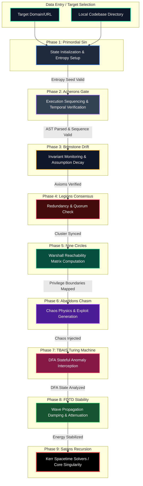

# PHASR: Speed & Balance Architecture

The core philosophy of the PHASR backend architecture is **Maximum Execution Speed** fused with **Ecosystem Balance**. We rely heavily on native APIs (Worker Threads, Server-Sent Events, and N-API bounds) rather than bloating the system with heavy external dependencies like Redis or WebSockets.

This document visualizes the exact lifecycle of data entering the system, undergoing high-performance parallel processing, and returning real-time cryptographic/security results to the user.

## The Complete System Workflow

This diagram illustrates the complete, end-to-end operational workflow of the **PHASR** architecture. It maps the journey from initial target scanning (Phase 1), through mathematical modeling and wave physics (Phases 2-4), to native Assembly mitigations and real-time monitoring (Phase 5).

```mermaid
graph TD
    %% Styling Classes
    classDef target fill:#0f172a,stroke:#00ffaa,stroke-width:2px,color:#fff
    classDef p1 fill:#1e293b,stroke:#3b82f6,stroke-width:2px,color:#fff
    classDef p2 fill:#334155,stroke:#8b5cf6,stroke-width:2px,color:#fff
    classDef p3 fill:#0f172a,stroke:#f59e0b,stroke-width:2px,color:#fff
    classDef p4 fill:#450a0a,stroke:#ff3366,stroke-width:2px,color:#fff
    classDef p5 fill:#064e3b,stroke:#10b981,stroke-width:2px,color:#fff
    classDef p6 fill:#4c1d95,stroke:#a855f7,stroke-width:2px,color:#fff
    classDef p7 fill:#831843,stroke:#f43f5e,stroke-width:2px,color:#fff
    classDef p8 fill:#14532d,stroke:#22c55e,stroke-width:2px,color:#fff
    classDef p9 fill:#000000,stroke:#ef4444,stroke-width:3px,color:#fff
    classDef monitor fill:#000000,stroke:#00ffaa,stroke-width:2px,color:#fff,stroke-dasharray: 5 5

    %% Data Entry / Target
    subgraph Input ["Data Entry / Target Selection"]
        T1[Target Domain/URL]:::target
        T2[Local Codebase Directory]:::target
    end

    %% Phase 1
    subgraph Phase1 ["Phase 1: Primordial Sin"]
        PS[State Initialization & Entropy Setup]:::p1
    end

    %% Phase 2
    subgraph Phase2 ["Phase 2: Acherons Gate"]
        AG[Execution Sequencing & Temporal Verification]:::p2
    end

    %% Phase 3
    subgraph Phase3 ["Phase 3: Brimstone Drift"]
        BD[Invariant Monitoring & Assumption Decay]:::p3
    end

    %% Phase 4
    subgraph Phase4 ["Phase 4: Legions Consensus"]
        LC[Redundancy & Quorum Check]:::p4
    end

    %% Phase 5
    subgraph Phase5 ["Phase 5: Nine Circles"]
        NC[Warshall Reachability Matrix Computation]:::p5
    end

    %% Phase 6
    subgraph Phase6 ["Phase 6: Abaddons Chasm"]
        AC[Chaos Physics & Exploit Generation]:::p6
    end

    %% Phase 7
    subgraph Phase7 ["Phase 7: TBAIS Turing Machine"]
        TM[DFA Stateful Anomaly Interception]:::p7
    end

    %% Phase 8
    subgraph Phase8 ["Phase 8: FDTD Stability"]
        FD[Wave Propagation Damping & Attenuation]:::p8
    end

    %% Phase 9
    subgraph Phase9 ["Phase 9: Satans Recursion"]
        SR[Kerr Spacetime Solvers / Core Singularity]:::p9
    end

    %% Flow Execution
    T1 --> PS
    T2 --> PS
    PS -->|Entropy Seed Valid| AG
    AG -->|AST Parsed & Sequence Valid| BD
    BD -->|Axioms Verified| LC
    LC -->|Cluster Synced| NC
    NC -->|Privilege Boundaries Mapped| AC
    AC -->|Chaos Injected| TM
    TM -->|DFA State Analyzed| FD
    FD -->|Energy Stabilized| SR
```

## The 9 Circles of PHASR Execution

### Phase 1: Primordial Sin (Initialization)
Before any logic runs, the system calculates cryptographic entropy and initializes base random seeds. If the initial state hash lacks the minimum required entropy threshold, the run aborts immediately to prevent predictable state paths.

### Phase 2: Acheron's Gate (Temporal Verification)
The system parses the codebase into an Abstract Syntax Tree (AST) using V8 Worker Threads. It maps the temporal execution logic, ensuring that processes cannot leapfrog prerequisites or bypass initialization validation gates.

### Phase 3: Brimstone Drift (Assumption Decay)
Analyzes the developer's assumptions against live architectural constraints. It continuously verifies massive arrays of invariants, calculating a Boolean product to ensure no silent assumption failures occur (e.g., verifying an internal IP is actually still internal).

### Phase 4: Legion's Consensus (Redundancy)
Verifies cluster replication, health, and failover capabilities. It guarantees that the mathematical engines calculating the vulnerability vectors have absolute quorum synchronization before moving to topological mapping.

### Phase 5: Nine Circles (Reachability Mapping)
Computes a dense $`O(V^3)`$ Warshall Reachability matrix on the execution paths. It calculates all horizontal and vertical access boundaries, pinpointing exact vectors where an untrusted session could connect to a highly secure internal object.

### Phase 6: Abaddon's Chasm (Chaos Physics)
The core physical simulation. It injects a "Chaos Wave" using Finite-Difference Time-Domain (FDTD) mechanics, modeling how a theoretical exploit propagates physically across the mapped topology until it hits a defensive barrier or triggers a fatal vulnerability.

### Phase 7: TBAIS Turing Machine (DFA Stateful Monitoring)
The Turing-Based Attacker Invalidation System builds a deterministic finite automaton (DFA) based on the expected execution flow. Any anomaly or deviation in the execution path instantly triggers a Turing Halt, locking down the node.

### Phase 8: FDTD Stability (Wave Attenuation)
Calculates the spatial and temporal damping factors (using the Courant number $`r = \frac{v \Delta t}{\Delta x} \leq 1.0`$) to ensure the exploit waves injected in Phase 6 stabilize and do not infinitely resonate in memory.

### Phase 9: Satan's Recursion (The Final Core)
The ultimate execution boundary. It maps the final state matrix onto a Kerr Spacetime Solver, evaluating the effective potential ($`V_{eff}`$) of the system state. If the simulated attacker bypasses all previous phases, they cross the event horizon. At this point, the node severs its own logical connection, ensuring the attacker is infinitely trapped in a black-hole recursive loop.
