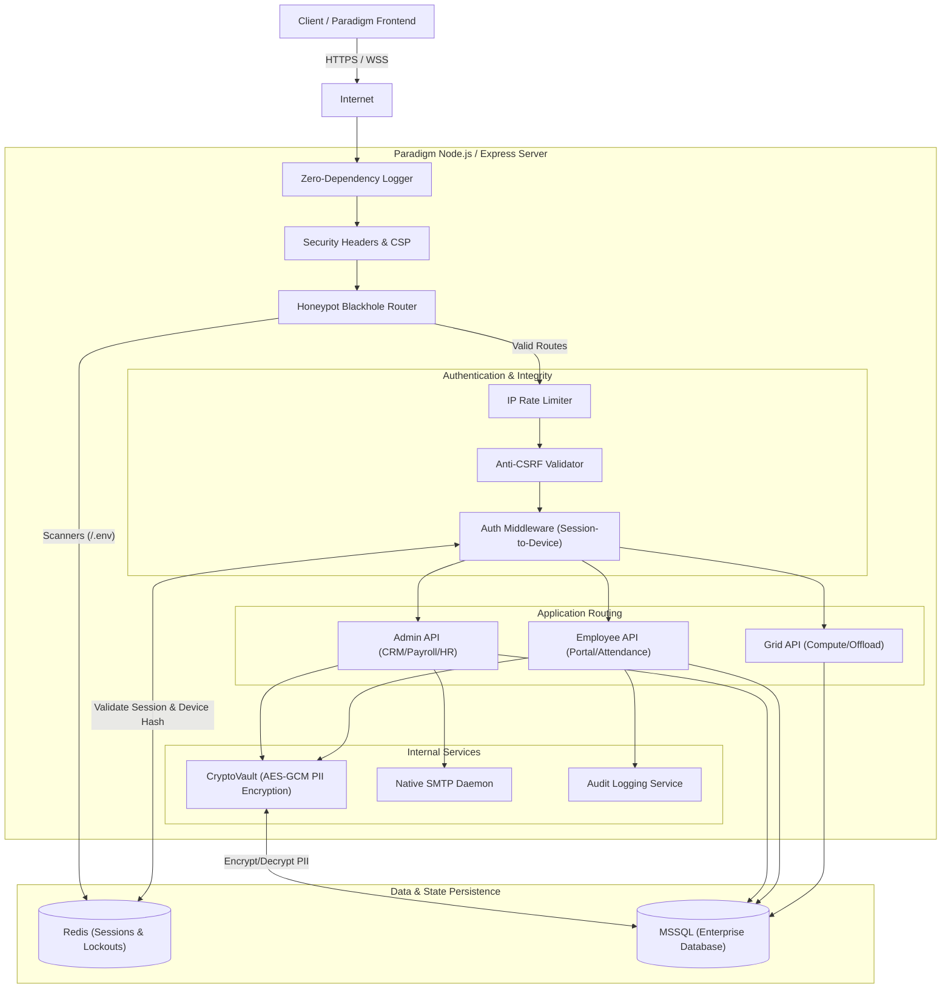

# Paradigm SaaS Architecture

This diagram maps out the core request lifecycle, security middleware, and data persistence layers of the Paradigm backend ecosystem.

## Architecture Highlights
- **Honeypot Blackhole:** Scanners are immediately dropped and their IPs blacklisted in Redis.
- **Session-to-Device Binding:** `Auth Middleware` cryptographically ties the session token to the user's IP and User-Agent.
- **PII CryptoVault:** The application layer performs AES-256-GCM encryption before data touches MSSQL.
- **Zero-Dependency Core:** Features like logging and the SMTP Daemon are built on top of native Node.js APIs to eliminate supply chain vulnerabilities.
