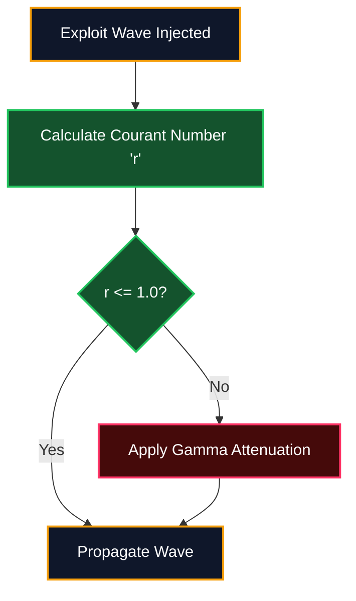

# Phase 8: FDTD Stability | Wave Propagation Damping & Attenuation

## 1. Target Workflow: Courant Condition Monitor
The **FDTD Stability Monitor** ensures that the simulated exploit waves (injected in Phase 6) do not result in infinite mathematical resonance that could crash the node. It enforces physical damping limits using the Courant number.

## 2. Execution Architecture

