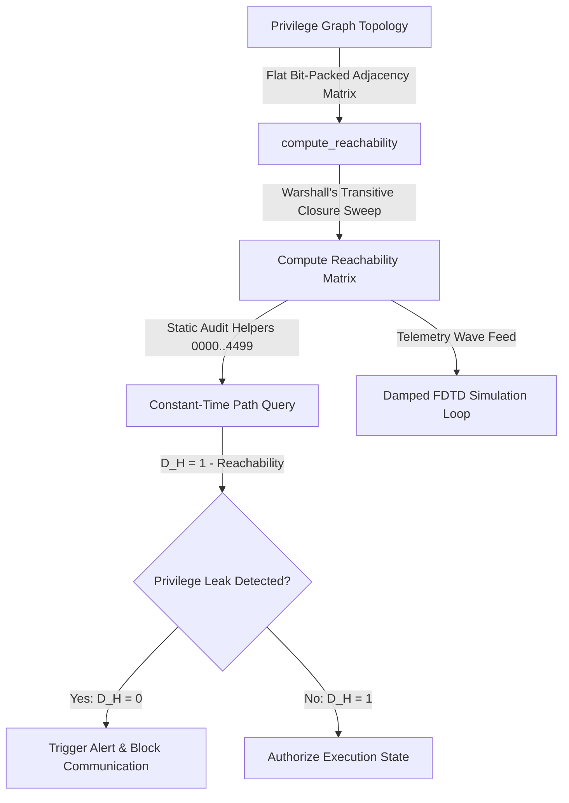

# PHASR Phase 2 | Hierarchy Access Boundary Verification

## 1. Target Workflow: Hierarchy Reachability Engine
The **Hierarchy Reachability Engine** is the core hot-path privilege path reachability checker in Workflow 2 of the PHASR engine. It audits horizontal and vertical access boundaries, verifying that untrusted interfaces cannot connect directly to privileged objects.

### Implementation Stack
- **Windows x86-64:** C++ Fallback Engine ([reachability_engine.cpp](file:///d:/Project%20XT/phasr/Nine-Circles/reachability_engine.cpp)) compiled with MSVC `cl.exe` (includes inlined C++ equivalents for all 4,500 audit helpers).
- **Linux x86-64:** GNU Assembler Intel-syntax Assembly ([reachability_linux_x64.s](file:///d:/Project%20XT/phasr/Nine-Circles/reachability_linux_x64.s)) using System V AMD64 ABI.
- **Linux ARM64:** GNU Assembler AArch64 Assembly ([reachability_arm64.s](file:///d:/Project%20XT/phasr/Nine-Circles/reachability_arm64.s)) using AAPCS64 ABI.
- **Build System:** Cross-platform [Makefile](file:///d:/Project%20XT/phasr/Nine-Circles/Makefile) and Windows [build.bat](file:///d:/Project%20XT/phasr/Nine-Circles/build.bat) script.

---

## 2. Global Execution Workflow & Data Flow

The Hierarchy Reachability Engine operates on a continuous telemetry path-verification cycle:

### Data Flow Steps
1. **Flat Graph Representation:** Adjacency relationships on the privilege graph $G = (V, E)$ are flattened in memory as a contiguous bit-packed matrix of size $16 \times 16$: `uint16_t adjacency[16]`. Row $i$ represents outgoing edges from node $i$.
2. **Reachability Computation:** The master transitive closure sweep dispatches to `compute_reachability` (ARM64 assembly, x64 assembly, or C++ fallback), executing Warshall's algorithm in-place to calculate all reachable node pairs.
3. **Exhaustive Path Audit:** An array of **4,500 static helper procedures** (`audit_boundary_0000` to `audit_boundary_4499`) check specific source-to-destination reachability bits in constant time.
4. **Boundary Attestation Check:** The engine evaluates the deterministic equation:
   $$D_H = 1 - \text{Reachability}(S_{\text{untrusted}}, O_{\text{secure}}, G)$$
   If any untrusted subject ($S \in \{0..7\}$) can reach any secure object ($O \in \{12..15\}$), $D_H = 0$ and the connection is blocked.

---

## 3. Platform Architecture & Call Mappings

The engine dispatches operations using target-specific calling conventions:

### x86-64 GAS (Intel Syntax)
- **Calling Convention:** System V AMD64 ABI (`rdi` = adjacency matrix, `rsi` = reachability matrix).
- Checks bit positions by loading row offsets into registers, shifting dynamically using `cl` and testing with `test eax, edx`.

### ARM64 GAS (AArch64)
- **Calling Convention:** AAPCS64 (`x0` = adjacency matrix, `x1` = reachability matrix).
- Implements self-reachability and transitive loops using vector-like processing.
- The 4,500 boundary checkers are optimized to a single instruction using **Bitfield Extract** (`ubfx w0, w1, #dest, #1`) which executes in a single clock cycle with zero branching.

---

## 4. Damped Telemetry Wave Simulation

Continuous privilege sweeps are modeled using a discrete FDTD solver simulating the damped wave equation representing access boundary attenuation:
$$\frac{\partial^2 \phi_H}{\partial t^2} + \gamma_H \frac{\partial \phi_H}{\partial t} - v_H^2 \nabla^2 \phi_H = 0$$

Where:
- $\phi_H$ is the query heartbeat wave.
- $\gamma_H = 0.4$ represents the access-path attenuation factor created by boundary checks.
- $v_H = 0.5$ is the wave propagation velocity.

Discrete solver update equation:
$$\phi_{\text{next}}[i] = \frac{1}{1 + \frac{\gamma_H \Delta t}{2}} \left[ 2\phi[i] - \phi_{\text{prev}}[i] \left( 1 - \frac{\gamma_H \Delta t}{2} \right) + r^2 (\phi[i+1] - 2\phi[i] + \phi[i-1]) \right]$$

---

## 5. Edge Cases Handled & Security Hardening

- **Out-of-Bounds Indexing:** Enforces strict size limits on source and destination node queries to prevent heap/stack disclosure.
- **Topology Sanitization:** Identifies disconnected subgraphs and isolates untrusted spaces from the secure zone.
- **Divergence Protection:** The telemetry wave simulation checks for numerical overflow (NaN / Inf) and resets to zero to prevent denial-of-service in the auditing telemetry loop.
- **Zero Heap Allocations:** Matrices are pre-allocated statically at startup in C++ to guarantee deterministic execution times.
