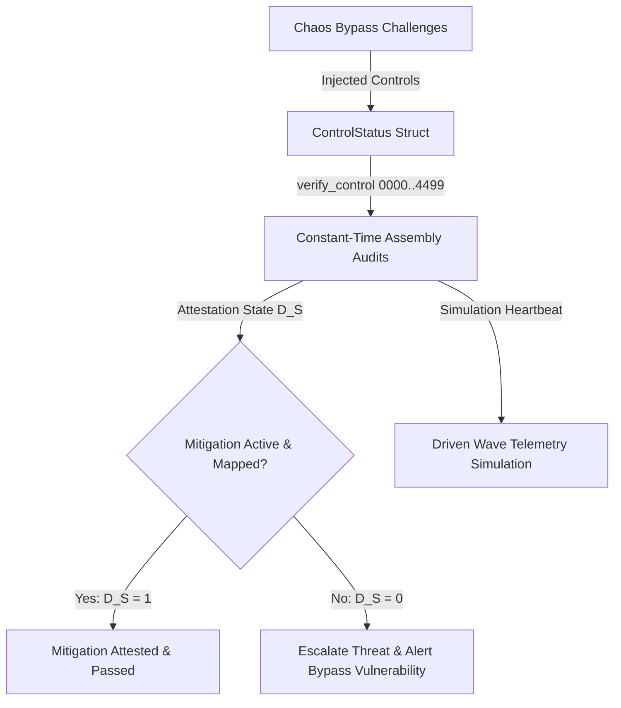

# PHASR Phase 4 | Solutions Mitigation & Chaos Verification

## 1. Target Workflow: Chaos Injector & Control Verifier
The **Chaos Injector & Control Verifier** is the security control validation engine in Workflow 4 of the PHASR platform. It injects simulated exploits (bypass challenges) into the system and audits active security mitigations (e.g., firewall states, privilege boundaries) using low-level assembly checks.

### Implementation Stack
- **Windows x86-64:** Modern C++ Fallback Engine ([chaos_verifier.cpp](file:///d:/Project%20XT/phasr/Phase-4/chaos_verifier.cpp)) compiled with MSVC `cl.exe`.
- **Linux x86-64:** GNU Assembler Intel-syntax Assembly ([control_linux_x64.s](file:///d:/Project%20XT/phasr/Phase-4/control_linux_x64.s)) using System V AMD64 ABI.
- **Linux ARM64:** GNU Assembler AArch64 Assembly ([control_arm64.s](file:///d:/Project%20XT/phasr/Phase-4/control_arm64.s)) using AAPCS64 ABI.
- **Build System:** Cross-platform [Makefile](file:///d:/Project%20XT/phasr/Phase-4/Makefile) and Windows [build.bat](file:///d:/Project%20XT/phasr/Phase-4/build.bat) script.

---

## 2. Global Execution Workflow & Data Flow

The Chaos Verifier executes 1,000 unit tests simulating active attacks and control validations:

### Data Flow Steps
1. **Challenge Injection:** The test harness models attacks by setting properties in a `ControlStatus` struct representing active/inactive status, thresholds, and latency metrics.
2. **Assembly Auditing:** Each test case calls a subset of **4,500 static helper routines** (`verify_control_0000` to `verify_control_4499`) in target-specific assembly.
3. **Attestation Evaluation:** The engine computes the safe attestation state:
   $$D_S = \text{control\_active} \times \text{coverage\_mapped}$$
   If any required control is inactive ($D_S = 0$), the challenge bypass succeeds and a security warning is logged.
4. **Driven Wave Update:** Heartbeat telemetry is routed to a discrete FDTD solver simulating continuous spatial-temporal driving force from attacks.

---

## 3. Platform Architecture & Call Mappings

The validation checks are executed using optimized calling conventions on target platforms:

### x86-64 GAS (Intel Syntax)
- **Calling Convention:** System V AMD64 ABI (`rdi` = pointer to `ControlStatus` struct).
- Performs direct offset-based double-bound checks (e.g., comparing `[rdi + offset1]` and `[rdi + offset2]`) and sets the boolean validation status in `eax`.

### ARM64 GAS (AArch64)
- **Calling Convention:** AAPCS64 (`x0` = pointer to `ControlStatus` struct).
- Loads status fields into registers via offset loads (e.g., `ldr w1, [x0, #offset]`), runs comparisons, and sets `w0` to the verification result.

---

## 4. Telemetry Driven Wave Simulation

The propagation of continuous chaotic injections is simulated using the driven wave equation:
$$\frac{\partial^2 \phi_S}{\partial t^2} - v_S^2 \nabla^2 \phi_S = A \sin(\omega_S t - k x)$$

Where:
- $\phi_S$ is the wave propagation amplitude.
- $v_S = 0.5$ is the propagation velocity.
- $\omega_S = 0.2$ is the temporal driving frequency.
- $k = 0.15$ is the spatial wave number.
- $A$ is the dynamic heartbeat amplitude ($A = \sin(\omega_S t)$).

---

## 5. Edge Cases Handled & Security Hardening

- **Negative & Zero Time-Steps:** Guard clauses discard invalid $\Delta t$ queries to prevent simulation instability.
- **Divergence Reset:** The simulation automatically catches invalid numbers (NaN or Inf) and auto-heals the grid states to zero.
- **Zero-Allocation Safety:** The verifier runs with zero heap allocations in the hot loop to prevent memory fragmentation and side-channel timing leaks.
