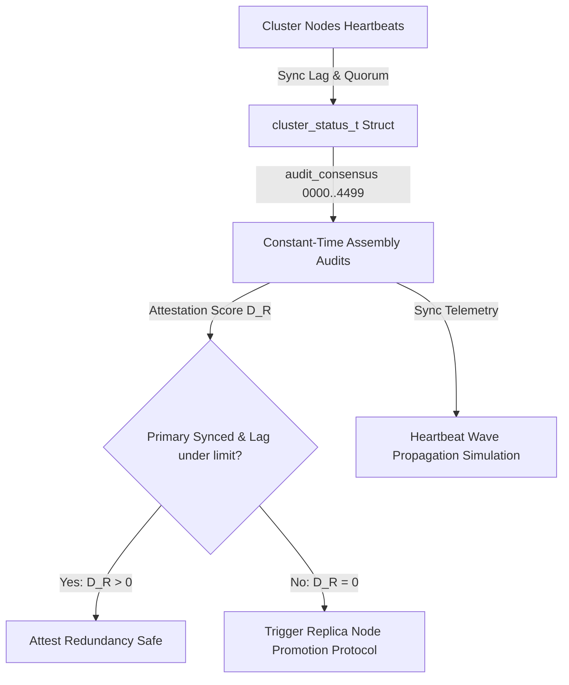

# PHASR Phase 5 | Redundancy Failover Attestation

## 1. Target Workflow: Redundancy Consensus Auditor
The **Redundancy Consensus Auditor** is the resilience verification engine in Workflow 5 of the PHASR engine. It audits cluster health, network replication lag, quorum consistency, and standby promotion readiness.

### Implementation Stack
- **Windows x86-64:** C Fallback Engine ([consensus_auditor.c](file:///d:/Project%20XT/phasr/Phase-5/consensus_auditor.c)) compiled with MSVC `cl.exe`.
- **Linux x86-64:** GNU Assembler Intel-syntax Assembly ([consensus_linux_x64.s](file:///d:/Project%20XT/phasr/Phase-5/consensus_linux_x64.s)) using System V AMD64 ABI.
- **Linux ARM64:** GNU Assembler AArch64 Assembly ([consensus_arm64.s](file:///d:/Project%20XT/phasr/Phase-5/consensus_arm64.s)) using AAPCS64 ABI.
- **Build System:** Cross-platform [Makefile](file:///d:/Project%20XT/phasr/Phase-5/Makefile) and Windows [build.bat](file:///d:/Project%20XT/phasr/Phase-5/build.bat) script.

---

## 2. Global Execution Workflow & Data Flow

The Consensus Auditor processes clustering nodes health:

### Data Flow Steps
1. **Replication Monitoring:** Active clustering metrics (Primary sync state, latency RTT, current term ID, active nodes count, replication lag) are populated in a `cluster_status_t` struct.
2. **Consensus Auditing:** The verifier dispatches metrics to **4,500 statically generated assembly checks** (`audit_consensus_0000` to `audit_consensus_4499`).
3. **Resilience Attestation:** The engine evaluates the attestation score:
   $$D_R = \text{PrimarySynced} \cdot \left( 1 - \frac{\text{Lag}_{\text{replica}}}{\text{Threshold}} \right)$$
   If the primary node becomes unsynced or replication lag exceeds the safety threshold, $D_R$ falls to 0, triggering the promotion of a backup standby node.
4. **Heartbeat Sync Simulation:** Telemetry heartbeats are simulated as a continuous wave propagating through the node cluster.

---

## 3. Platform Architecture & Call Mappings

The auditor dispatches invariant audits using target-specific calling conventions:

### x86-64 GAS (Intel Syntax)
- **Calling Convention:** System V AMD64 ABI (`rdi` = pointer to `cluster_status_t` struct).
- Performs direct memory offset boundary checks against immediate limits using `cmp` and branches.

### ARM64 GAS (AArch64)
- **Calling Convention:** AAPCS64 (`x0` = pointer to `cluster_status_t` struct).
- Loads 32-bit fields from structure offsets via `ldr w1, [x0, #offset]`, compares them against limit values, and returns the result in `w0`.

---

## 4. Telemetry Consensus Wave Simulation

Heartbeat synchronization between cluster node groups is simulated using the FDTD wave equation:
$$\frac{\partial^2 \phi_R}{\partial t^2} - v_R^2 \nabla^2 \phi_R = 0$$

Where:
- $\phi_R$ is the sync heartbeat wave.
- $v_R = 0.5$ represents the consensus network transmission speed.
- The boundary node 0 is driven periodically: $\phi_R[0] = \sin(\omega_R t)$ with frequency $\omega_R = 0.2$.

---

## 5. Edge Cases Handled & Security Hardening

- **Election Timeout Validation:** Prevents replication loops and split-brain scenarios by verifying that timeout configurations exceed RTT values.
- **Negative & Zero Time-Steps:** Filters invalid step parameters in the FDTD solver to maintain mathematical convergence.
- **Numerical Overflow Reset:** Automatically checks grid variables for NaN/Inf values and resets the sync telemetry history to zero to prevent denial-of-service.
- **Zero Allocation Safety:** Zero heap allocation guarantees consistent execution timing to defend against side-channel analysis.
