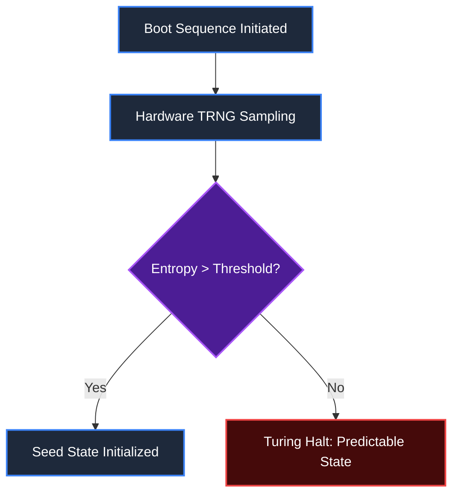

# Phase 1: Primordial Sin | State Initialization & Entropy Setup

## 1. Target Workflow: Entropy Validator
The **Entropy Validator** ensures that the system state is initialized with absolute cryptographic randomness before any further PHASR sequences execute. If the entropy pool is compromised or predictable, it halts the entire pipeline to prevent deterministic exploits.

## 2. Execution Architecture

