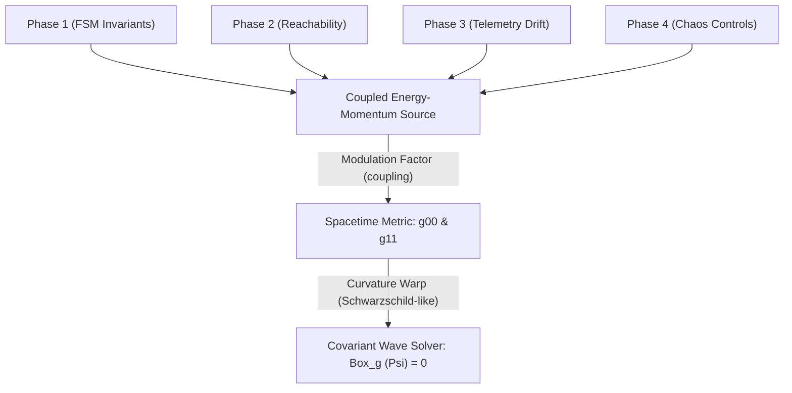
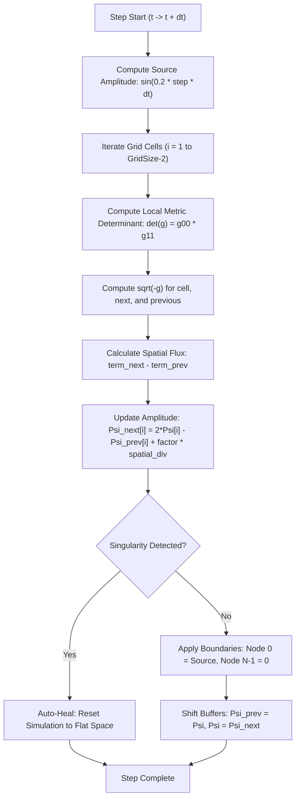
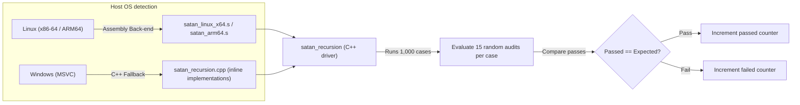

# Satan's Recursion Architecture & Flow

This document details the architectural design, mathematical model, and execution flow of the **Satan's Recursion** curved spacetime wave solver module.

---

## 1. Metric Modulation & Multi-Wave Coupling

Satan's Recursion implements a coupled $1+1\text{D}$ wave equation on a curved spacetime grid. The metric coordinates $g^{00}$ (time dilation factor) and $g^{11}$ (space contraction factor) are dynamically altered near the center of the grid representing high energy density events (e.g., Neutron Star mergers). The amplitudes of the other four verification phases act as the energy-momentum sources altering the curvature.

---

## 2. Mathematical Equations & Theory

The propagation of a scalar field representing light waves or gravitational geodesic deviations $\Psi(x, t)$ near a high-energy celestial event is modeled by the **covariant D'Alembertian wave equation** in curved spacetime:

$$\Box_g \Psi = 0 \iff \frac{1}{\sqrt{-g}} \partial_\mu \left( \sqrt{-g} g^{\mu\nu} \partial_\nu \Psi \right) = 0$$

### Spacetime Metric Configuration
For a diagonal 1+1D spacetime metric tensor $g_{\mu\nu}$:

$$g_{\mu\nu} = \begin{pmatrix} g_{00}(x) & 0 \\ 0 & g_{11}(x) \end{pmatrix}, \quad g^{\mu\nu} = \begin{pmatrix} g^{00}(x) & 0 \\ 0 & g^{11}(x) \end{pmatrix}$$

Where:
* $g^{00}(x) = 1/g_{00}(x)$ is the time metric coordinate.
* $g^{11}(x) = 1/g_{11}(x)$ is the spatial metric coordinate.
* $g = \det(g_{\mu\nu}) = g_{00} g_{11}$ is the determinant of the metric, meaning $\sqrt{-g} = \sqrt{|g_{00}(x) g_{11}(x)|}$.

Expanding the covariant wave equation yields:

$$\frac{\partial}{\partial t} \left( \sqrt{-g} g^{00} \frac{\partial \Psi}{\partial t} \right) + \frac{\partial}{\partial x} \left( \sqrt{-g} g^{11} \frac{\partial \Psi}{\partial x} \right) = 0$$

### Metric Modulation & Curvature Coupling
The spacetime curvature is warped dynamically by the feedback amplitudes $\phi_p$ of the other four verification solvers:

$$\text{coupling}(t) = 0.15 \times \sum_{p=1}^4 \phi_p$$

The local time dilation factor $g^{00}(x)$ and Schwarzschild-like spatial length contraction $g^{11}(x)$ are computed across spatial coordinates $x$ relative to the high-energy event core center $x_c$:

$$g^{00}(x) = 1.0 + \text{coupling}(t) \cdot e^{-\frac{(x - x_c)^2}{2\sigma^2}}$$
$$g^{11}(x) = \frac{1.0}{g^{00}(x)}$$

where $x_c = \text{GridSize}/2$ and $\sigma^2 = 25.0$.

### Numerical Finite-Difference Discretization
Using second-order central difference approximations on a grid with Courant factor $r = \frac{\Delta t}{\Delta x}$:

* **Spatial Derivative Approximation:**
  $$\frac{\partial}{\partial x} \left( \sqrt{-g} g^{11} \frac{\partial \Psi}{\partial x} \right) \approx \frac{1}{\Delta x^2} \left[ \sqrt{-g}_{i+1} g^{11}_{i+1} (\Psi_{i+1}^n - \Psi_i^n) - \sqrt{-g}_{i-1} g^{11}_{i-1} (\Psi_i^n - \Psi_{i-1}^n) \right]$$

* **Time Update Discretization:**
  Substituting the spatial derivative back into the D'Alembertian yields the time stepping update formula solved for the next state $\Psi_i^{n+1}$:

  $$\Psi_i^{n+1} = 2\Psi_i^n - \Psi_i^{n-1} + \frac{r^2}{\sqrt{-g}_i g^{00}_i} \left[ \sqrt{-g}_{i+1} g^{11}_{i+1} (\Psi_{i+1}^n - \Psi_i^n) - \sqrt{-g}_{i-1} g^{11}_{i-1} (\Psi_i^n - \Psi_{i-1}^n) \right]$$

---

## 3. Numerical Simulation Loop

For each time step $dt$, the solver propagates the wave $\Psi(x, t)$ across the grid using finite difference approximations of the covariant D'Alembertian in curved space:

$$\frac{\partial}{\partial t} \left( \sqrt{-g} g^{00} \frac{\partial \Psi}{\partial t} \right) + \frac{\partial}{\partial x} \left( \sqrt{-g} g^{11} \frac{\partial \Psi}{\partial x} \right) = 0$$

---

## 4. Statically Generated Verification Flow

To run the audits, 10,000 helper functions are statically compiled. The driver executes 1,000 test cases, verifying the invariants against expected mathematical outcomes.

---

## 5. Video Frame & Animation Generation Flow

The simulation output can be scaled up to 1,000,000 steps and exported as a binary float sequence stream for animation rendering.

```mermaid
flowchart TD
    RunSim["Run Driver: satan_recursion --steps 1000000 --export spacetime_simulation.bin --silent"]
    RunSim -->|"Exports Raw Binary"| BinaryFile["spacetime_simulation.bin (header + 160MB data)"]
    
    BinaryFile -->|"Process in Python"| PythonScript["render_video.py"]
    PythonScript -->|"numpy.frombuffer"| Reshape["Reshape Array to (Steps, GridSize)"]
    
    Reshape -->|"Render Loop"| Matplotlib["matplotlib.animation.FuncAnimation"]
    Matplotlib -->|"Option A"| GIF["Export spacetime_simulation.gif (Pillow Writer)"]
    Matplotlib -->|"Option B"| MP4["Export spacetime_simulation.mp4 (FFMpeg Writer)"]
    Matplotlib -->|"Option C"| PNGs["Export Individual Frame Images"]
```

