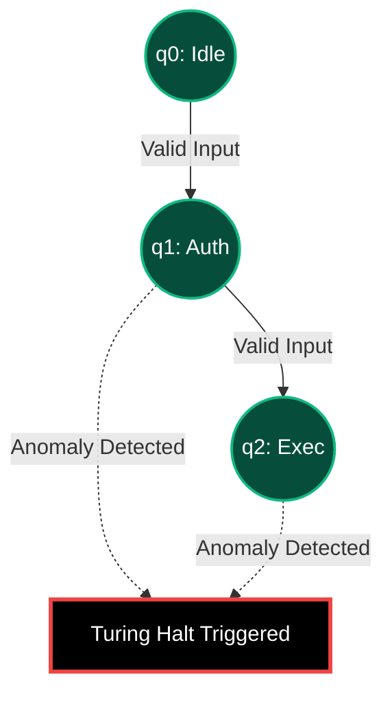

# Phase 7: TBAIS Turing Machine | DFA Stateful Anomaly Interception

## 1. Target Workflow: Sentinel DFA Node
The **Turing-Based Attacker Invalidation System (TBAIS)** continuously evaluates the system's execution flow against a predetermined Deterministic Finite Automaton (DFA). It acts as the ultimate anomaly interceptor, firing a Turing Halt if an attacker attempts an illegal state transition.

## 2. Execution Architecture

