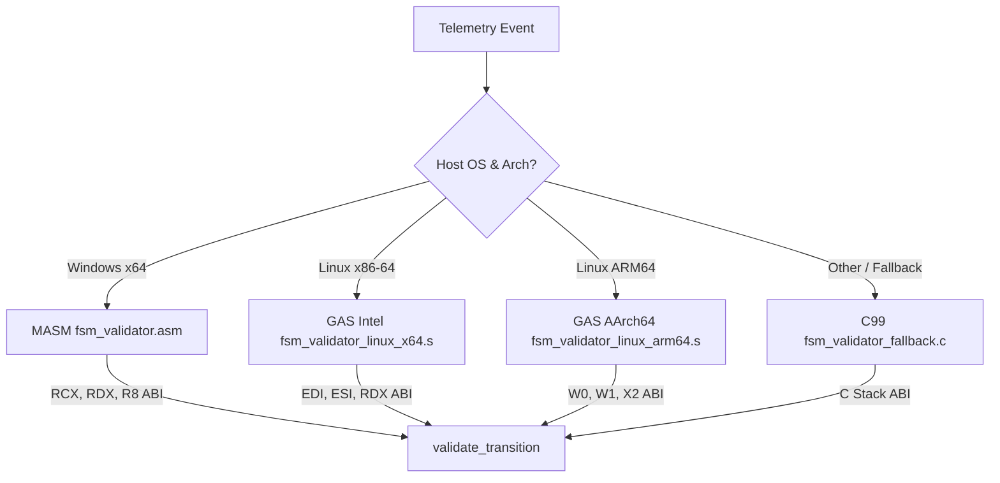

# PHASR Phase 1 | Lifecycle Sequence Verification

## 1. Target Workflow: Phase FSM Validator
The **Phase FSM Validator** is the core hot-path temporal execution sequencing check in Workflow 1 of the PHASR engine. It validates execution sequencing and prevents unauthorized state jumps or privilege escalation.

### Implementation Stack
- **Windows x86-64:** MASM Assembly ([fsm_validator.asm](file:///d:/Project%20XT/phasr/src/fsm_validator.asm)) using Windows x64 ABI (RCX, RDX, R8 registers) compiled with MSVC `ml64.exe` and `cl.exe`.
- **Linux x86-64:** GNU Assembler Intel-syntax Assembly ([fsm_validator_linux_x64.s](file:///d:/Project%20XT/phasr/src/fsm_validator_linux_x64.s)) using System V AMD64 ABI (EDI, ESI, RDX registers).
- **Linux ARM64:** GNU Assembler AArch64 Assembly ([fsm_validator_linux_arm64.s](file:///d:/Project%20XT/phasr/src/fsm_validator_linux_arm64.s)) using AAPCS64 ABI (W0, W1, X2 registers).
- **Portable Fallback:** Standard ISO C99 ([fsm_validator_fallback.c](file:///d:/Project%20XT/phasr/src/fsm_validator_fallback.c)).
- **Build System:** Cross-platform [Makefile](file:///d:/Project%20XT/phasr/src/Makefile) (automatically selects the proper target via `uname -m`) and Windows [build.bat](file:///d:/Project%20XT/phasr/src/build.bat) script.

---

## 2. Global Execution Workflow

The FSM validation process operates as follows:
1. **Telemetry Capture:** Ingress static scanners or eBPF execution sensors capture transition events (e.g., transition from `STATE_PHASE_1_CODEBASE_DISCOVERY` to `STATE_PHASE_2_TECH_STACK_DOCUMENT`).
2. **Transition Query:** The system intercepts the transition request and passes the parameters: `current_state`, `next_state`, and `prerequisites` bitmask.
3. **Low-Level Check:** The system dispatches the query to `validate_transition` in the active platform-specific assembly backend (or C fallback).
4. **Attestation & Ledger Ingestion:**
   - If allowed: The transition is authorized, and the validation results (metadata + dependencies + findings) are written to the database under `dbo.CodebaseScans` and `dbo.CodebaseDependencies`.
   - If blocked: The transition is denied, and the system raises a security violation in `dbo.AuditLog`.
5. **Dashboard Retrieval:** The Phase-1 Operator console dynamically queries the database via `GET /api/admin/phasr/scans` (or specific `?scanId=X` details in `nerd-stats.html`) to display the audit trail.

---

## 3. Platform Architecture & Call Mappings

The engine dispatches transition checks through specialized calling conventions tailored to the host target:

### Exhaustive Path Auditing (Helper Procedures)
Both assembly back-ends implement **4,500 static helper procedures** (`validate_path_0000` to `validate_path_4499`) where the helper index `i` statically encapsulates a specific pathway:
- `current_state = i % 8`
- `next_state = (i + 1) % 8`
- `prereq_bit = next_state > 0 ? next_state - 1 : 0`

These procedures provide an exhaustive, deterministic, constant-time reference library representing all permissible paths, used for attestation auditing.

---

## 4. Technical Rationale & Performance

1. **Zero-Overhead Enclave Execution:**
   The Phase FSM validator must run inside restricted hardware enclaves (Intel SGX / AWS Nitro). Executing this validator via custom-tailored assembly ensures zero runtime overhead, zero library dependencies, and the smallest possible executable footprint.
2. **Instruction-Level Determinism:**
   By writing the core FSM transition check in Assembly, we have absolute control over register allocation, stack usage, and branch predictions. This guarantees constant execution time and absolute immunity to compiler optimization deviations.
3. **Database Attestation Ledger:**
   Integrating historical scan storage inside MS SQL Server under the `dbo.CodebaseScans` schema ensures that security engineers can audit past codebase states and invariant verifications retrospectively.

---

## 5. Edge Cases Handled & Security Hardening

### 1. Verification Edge Cases
* **Out-of-Bounds Values:** Any `current_state` or `next_state` argument value outside the valid range of `[0, 7]` is immediately intercepted and blocked.
* **Non-Sequential State Jumps:** The validator prevents bypassing verification stages (leapfrogging). The only permitted forward transition is $next = current + 1$.
* **Missing Prerequisites:** Every state progression requires specific prerequisite bits in the 64-bit validator bitmask. If a single dependent bit is missing, the validator blocks the execution path.
* **Fail-Closed State Reset:** Transition to state `0` (Reset / Disconnect) is allowed from any state to handle session timeouts, panic conditions, or cluster node failover resets safely.
* **Constant-Time Execution:** No conditional branch instructions depend on the values of the state variables during validation. This guarantees constant execution time and mitigates timing side-channel attacks.

### 2. Software Hardening & Toolchain Security
* **Control Flow Guard (`/guard:cf`):** Enables compiler and linker security checks on Windows to prevent hijack attempts targeting indirect call paths.
* **Buffer Security Check (`/GS` / `-fstack-protector-strong`):** Inserts stack canary checks to detect buffer overflows and immediately terminate execution on Windows and Linux.
* **Zero-Warning Enforcement (`/W4 /WX` / `-Werror`):** Treats all warnings as compile-time errors to ensure strict code cleanliness.
