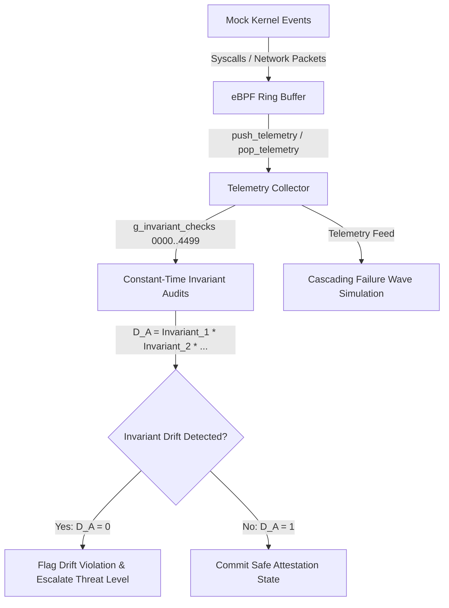

# PHASR Phase 3 | Invariant Drift & Telemetry Monitoring

## 1. Target Workflow: Telemetry Collector & Assumption Graph
The **Telemetry Collector & Assumption Graph** is the core hot-path invariant drift checker in Workflow 3 of the PHASR engine. It monitors system calls and network telemetry via mock eBPF ring buffers, auditing invariants in real-time to detect architectural and performance drift.

### Implementation Stack
- **Windows x86-64:** C Wrapper & Fallback Engine ([telemetry_collector.c](file:///d:/Project%20XT/phasr/Phase-3/telemetry_collector.c)) compiled with MSVC `cl.exe`.
- **Linux x86-64:** GNU Assembler Intel-syntax Assembly ([telemetry_linux_x64.s](file:///d:/Project%20XT/phasr/Phase-3/telemetry_linux_x64.s)) using System V AMD64 ABI.
- **Linux ARM64:** GNU Assembler AArch64 Assembly ([telemetry_arm64.s](file:///d:/Project%20XT/phasr/Phase-3/telemetry_arm64.s)) using AAPCS64 ABI.
- **Build System:** Cross-platform [Makefile](file:///d:/Project%20XT/phasr/Phase-3/Makefile) and Windows [build.bat](file:///d:/Project%20XT/phasr/Phase-3/build.bat) script.

---

## 2. Global Execution Workflow & Data Flow

The Telemetry Collector processes kernel events through a zero-allocation ring buffer:

### Data Flow Steps
1. **Event Capture:** Syscall frequency, network packets, CPU usage, memory, disk I/O, open file descriptors, and active TCP connections are captured into a `telemetry_event_t` structure.
2. **Ring Buffer Queuing:** Events are pushed into a thread-safe emulated eBPF ring buffer (`ring_buffer_t`) using head/tail pointer increments with zero heap allocations.
3. **Assembly Verification:** The collector pops events and audits them against **4,500 statically generated invariant checks** in assembly (`check_invariant_0000` to `check_invariant_4499`).
4. **Attestation Check:** If any invariant check fails ($D_A = 0$), the collector flags architectural drift and triggers alert warnings.

---

## 3. Platform Architecture & Call Mappings

The engine dispatches invariant audits using target-specific calling conventions:

### x86-64 GAS (Intel Syntax)
- **Calling Convention:** System V AMD64 ABI (`rdi` = pointer to `telemetry_event_t`).
- Audits field values at memory offsets (e.g. `[rdi + 0]` for syscalls, `[rdi + 8]` for CPU) directly against immediate limits using `cmp` and branches.

### ARM64 GAS (AArch64)
- **Calling Convention:** AAPCS64 (`x0` = pointer to `telemetry_event_t`).
- Loads 32-bit fields using offset-based `ldr` instructions (e.g. `ldr w1, [x0, #8]`) and compares them against thresholds.
- Zero-extends the boolean return status (1 = valid, 0 = invalid) in `w0`.

---

## 4. Cascading Failure Wave Simulation

 cascading failure propagation across dependency chains is modeled using a discrete FDTD solver simulating the wave equation:
$$\frac{\partial^2 \phi_A}{\partial t^2} + \gamma_A \frac{\partial \phi_A}{\partial t} = v_A^2 \nabla^2 \phi_A$$

Where:
- $\phi_A$ represents the failure propagation amplitude.
- $\gamma_A = 0.3$ is the cascading decay/attenuation factor.
- $v_A = 0.5$ is the propagation velocity.
- The failure wave originates at node 0 and decays spatially according to $\alpha = \frac{\gamma_A v_A}{2} = 0.075$, matching the theoretical decay envelope $\phi_A(x, t) = \phi_0 e^{-\alpha x} \cos(k x - \omega t)$.

---

## 5. Edge Cases Handled & Security Hardening

- **Ring Buffer Overflows:** Strictly monitors boundary wraps to prevent event overwrite and denial-of-service.
- **Constant-Time Verification:** The assembly routines execute sequentially without loop overhead, preventing timing side-channel leaks.
- **Telemetry Wave Divergence:** Integrates validation guards in the FDTD update loop to catch and heal numerical instabilities (NaN/Inf) automatically.
